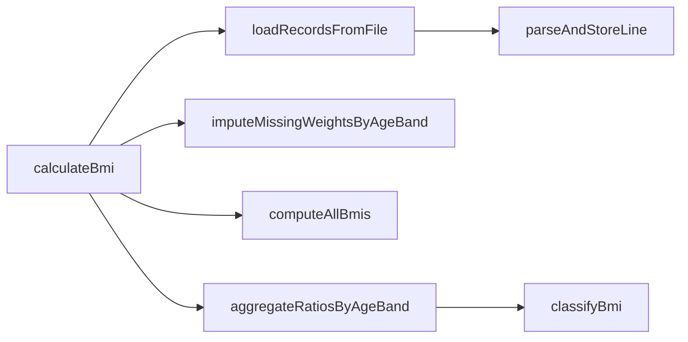

# SHealth BMI — 1차 리팩토링 보고서 (2단계)

| 항목 | 내용 |
|------|------|
| 프로젝트 | SHealth BMI (삼성 헬스 연령대별 BMI 통계) |
| 기술 스택 | C++17, CMake 3.10+, Google Test v1.14 |
| 작성일 | 2026-05-20 |
| 보고 범위 | README 2단계 — 네이밍 · 상수화 · 함수 추출 · DRY (4/4) |
| 관점 | 클린코드 1차 리팩토링 (동작 보존) |
| 선행 문서 | [03_코드품질분석.md](./03_코드품질분석.md), [.cursorrules](../.cursorrules) |
| Git 브랜치 | `refactoring` (`03ddafb` ~ `bf6a86d` + 4/4 로컬) |

---

## 요약

레거시 `SHealth::calculateBmi` God Method를 **동작 변경 없이** 4단계로 개선했다. public API(`calculateBmi`, `getBmiRatio`)는 유지했고, `./SHealthBMI` 6개 연령대 출력은 **0단계 기준선과 동일**함을 매 단계 빌드·실행으로 확인했다. 의도적으로 미수정한 항목: **BMI=25 미분류**, **0 나눗셈 가드** — 3단계 Unit Test(TC 16·7·20) 이후 처리 예정.

---

## 1. 목표와 달성도

### 1.1 README Activities (2단계)

| # | 항목 | 상태 | 비고 |
|---|------|:----:|------|
| 1 | 네이밍 개선 | [x] | `ageBandStart`, `recordCount`, `BmiCategoryCode` 등 |
| 2 | 하드코드·매직 넘버 상수화 | [x] | `SHealthConstants` namespace |
| 3 | 함수 추출 | [x] | private 6개 + Facade `calculateBmi` |
| 4 | 반복/중복 제거 | [x] | `AgeBandRatios[6]`, `isInAgeBand`, 테이블 조회 |

### 1.2 제약 준수

| 제약 | 준수 |
|------|:----:|
| C++17만 사용 | ○ |
| public API 시그니처 유지 | ○ |
| README 4단계 신기능 미구현 | ○ |
| `vector` 전환·클래스 분리·istream 주입 미수행 | ○ |
| 버그 수정(BMI≥25, ageCount/sum==0) 미수행 | ○ (의도적) |

---

## 2. 단계별 작업 요약

### 2.1 1/4 — 네이밍

| Before | After | 효과 |
|--------|-------|------|
| `count` | `recordCount` | 레코드 수 의미 명확 |
| `a`, `i` | `ageBandStart`, `recordIndex` | 루프 의도 드러남 |
| `sum` (2종) | `weightSum`, `bandMemberCount` | 체중 합 vs 인원 수 구분 |
| `type` 100~400 | `BmiCategoryCode` enum | 분류 코드 의미화 |
| 24 멤버 | 주석 (ageBand suffix) | 구조 변경 없이 문서화 |

### 2.2 2/4 — 상수화

`SHealthConstants`에 README F-05·도메인 상수 집약:

| 상수 | 값 | 용도 |
|------|-----|------|
| `kBmiUnderMax` | 18.5 | 저체중 상한 |
| `kBmiNormalMax` | 23.0 | 정상 상한(미만) |
| `kBmiOverweightMax` | 25.0 | 과체중 상한(미만) |
| `kAgeBandStartMin/Max/Step/Width` | 20, 70, 10, 10 | 연령대 루프 |
| `kCsvColAge/Weight/Height` | 1, 2, 3 | CSV 파싱 |
| `kHeightCmPerMeter` | 100.0 | cm → m |
| `kDefaultDataFile` | `shealth.dat` | main 입력 파일 |

### 2.3 3/4 — 함수 추출 (Facade)



| 메서드 | 책임 |
|--------|------|
| `calculateBmi` | 파이프라인 Facade (4단계 호출) |
| `loadRecordsFromFile` | 파일 열기·헤더 스킵·라인 로드 |
| `parseAndStoreLine` | CSV 1줄 → 배열 적재 |
| `imputeMissingWeightsByAgeBand` | 체중 0 → 연령대 평균 보정 |
| `computeAllBmis` | 전 레코드 BMI 계산 |
| `classifyBmi` | BMI → `BmiClassSlot` (미분류 `None`) |
| `aggregateRatiosByAgeBand` | 연령대별 비율(%) 집계 |

### 2.4 4/4 — DRY

| 구간 | Before | After | 절감(약) |
|------|--------|-------|----------|
| 비율 저장 | 24 `double` + 6×`if-else` | `AgeBandRatios ageBandRatios[6]` + 루프 | ~27줄 |
| `getBmiRatio` | 24중첩 `if` | `ageBandIndexFromClass` + `ratioForCategory` | ~34줄 |
| 연령대 조건 | 4곳 중복 `age >= …` | `isInAgeBand()` | ~8줄 |
| `SHealthBMI.cpp` | 6회 `printf` 복사 | `kAgeBandCount` 루프 | ~46줄 |

**선택:** 24 멤버 유지 vs struct 6개 → **`AgeBandRatios[6]` 테이블** 채택 (한 종류 구조 변경).

---

## 3. 코드 품질 Before & After

### 3.1 Before (리팩토링 전)

```
SHealth::calculateBmi  (~100줄, 6블록 일괄)
  ├─ ifstream + CSV + 배열 적재
  ├─ 연령대별 체중 보정 (중복 루프)
  ├─ BMI 계산
  └─ 분류·집계·underweight20~obesity70 (6×if-else × 4필드)

getBmiRatio  (24분기, type 100/200/300/400)
```

**주요 스멜:** Long Method, Magic Number, Duplicated Code, Data Clumps(24변수).

### 3.2 After (리팩토링 후)

```
SHealth::calculateBmi  (Facade, ~8줄)
  → loadRecordsFromFile → parseAndStoreLine
  → imputeMissingWeightsByAgeBand  (isInAgeBand)
  → computeAllBmis
  → aggregateRatiosByAgeBand       (classifyBmi, ageBandRatios[])

getBmiRatio  (인덱스 + category switch, ~15줄)
```

**개선:** 단계별 private 메서드로 테스트·리뷰 단위 축소, 상수·테이블로 의미·확장 지점 명확화.

### 3.3 정량 비교 (대략)

| 지표 | Before | After |
|------|--------|-------|
| `calculateBmi` 본문 | ~100줄 | ~8줄 (Facade) |
| `getBmiRatio` 분기 | 24 `if-else` | 테이블 + `switch` |
| 연령대 비율 저장 필드 | 24 `double` | 6 × `AgeBandRatios` |
| private 헬퍼 | `split`만 | 10개 메서드 |
| `SHealth.cpp` 총줄 | ~150 | ~200 (분리로 줄 수는 증가, 중복은 감소) |

---

## 4. 동작 보존 검증 (0단계 기준선)

### 4.1 확인 절차

```bash
cd build
cmake -G "MinGW Makefiles" -DCMAKE_CXX_COMPILER=g++.exe ..   # 최초 1회
cmake --build .
./SHealthBMI.exe    # Windows: .\SHealthBMI.exe
# shealth.dat는 실행 디렉터리 또는 프로젝트 루트에서 로드
```

### 4.2 기준선 출력 (`shealth.dat`)

| ageBand | underweight | normal | overweight | obesity |
|---------|-------------|--------|------------|---------|
| 20 | 3.511053 | 23.797139 | 11.833550 | 60.858257 |
| 30 | 1.863354 | 15.527950 | 10.062112 | 72.546584 |
| 40 | 0.521512 | 10.039113 | 9.126467 | 80.312907 |
| 50 | 2.181401 | 12.629162 | 9.988519 | 75.200918 |
| 60 | 0.862895 | 8.533078 | 10.642378 | 79.961649 |
| 70 | 0.529101 | 12.345679 | 10.758377 | 76.366843 |

4단계 완료 후 **6줄 모두 일치** 확인.

---

## 5. 의도적 미수정 (3단계 TC 연계)

| 이슈 | 현재 코드 | README | 대응 TC |
|------|-----------|--------|---------|
| BMI=25 미분류 | `> kBmiOverweightMax` | ≥25 비만 | **16** |
| `ageCount==0` 보정 | 가드 없음 | 0 나눗셈 위험 | **7** |
| `bandMemberCount==0` 집계 | 가드 없음 | NaN 가능 | **20** |
| `height==0` | 미보정 | F-10 (4단계) | 5, 33 |
| `FAIL()` 스텁 | `SHealthBMITest` | Green 게이트 | **37** |

리팩토링 단계에서는 **관찰 가능한 출력 동일**을 우선했다.

---

## 6. AI 활용 요약

| 단계 | 활용 방식 | 효과 |
|------|-----------|------|
| 사전 | PCTF 프롬프트 + `@.cursorrules` + `docs/code_quality_report.md` | 단계별 금지·순서 고정 |
| 각 턴 | 「한 축만」「기준선 출력 확인」 명시 | 동작 드리프트 방지 |
| 4/4 | struct 6 vs 24멤버 중 **한 종류만** 선택 지시 | 과도한 구조 변경 방지 |

**한계:** `ctest` Green 전 대규모 변경은 `.cursorrules`와 충돌 — 테스트 스텁 제거 후 3단계 진행 권장.

---

## 7. 다음 단계 (3~4단계)

| 순서 | 작업 | 참고 |
|:----:|------|------|
| 1 | `FAIL()` 제거, `TEST_F` 픽스처 | TC 37, 38 |
| 2 | BMI·보정·분류·예외 TC (Given-When-Then) | TC 1~28, **16·7·20** Red→Green |
| 3 | `istream` 주입·Parser 분리 | TC 32, SRP 준비 |
| 4 | README 4단계 (Height 0, 목록, 전체 비율) | F-10~F-12 |

---

## 8. 변경 파일·커밋 참고

| 파일 | 변경 요약 |
|------|-----------|
| `src/main/cpp/SHealth.h` | 상수·enum·struct·private API |
| `src/main/cpp/SHealth.cpp` | Facade·헬퍼·테이블 |
| `src/main/cpp/SHealthBMI.cpp` | 상수·출력 루프 |
| `README.md` | 2단계 체크리스트 [x] |
| `.gitignore` | `build/` 제외 |

**GitHub (`refactoring`):** `03ddafb`(1/4) → `6f98d77`(2/4) → `bf6a86d`(3/4) — 4/4는 로컬 작업 후 푸시 예정.

---

## 참고 문서

| 문서 | 용도 |
|------|------|
| [README.md](../README.md) | Activities·도메인 규칙 |
| [docs/requirements_analysis.md](../docs/requirements_analysis.md) | F-01~F-12, TC 1~39 |
| [docs/code_quality_report.md](../docs/code_quality_report.md) | 스멜·로드맵 원문 |
| [03_코드품질분석.md](./03_코드품질분석.md) | 리팩토링 전 분석 |
| [01_실습보고서.md](./01_실습보고서.md) | 전체 실습 회고(5단계) |

---

*작성 기준: `src/main/cpp` 4/4 DRY 완료 시점, `shealth.dat` 기준선 출력.*
