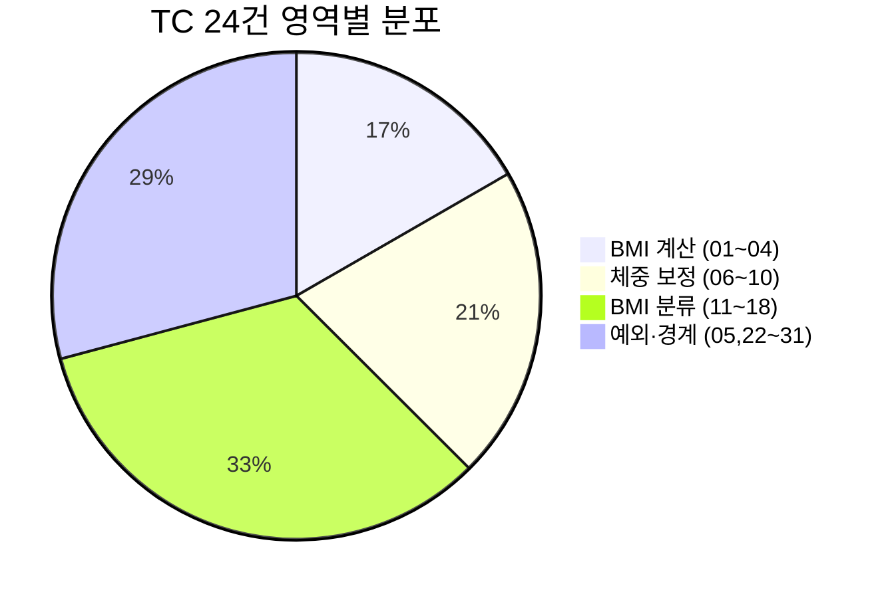

# SHealth BMI — 단위 테스트 계획 보고서 (3단계)

| 항목 | 내용 |
|------|------|
| 프로젝트 | SHealth BMI (삼성 헬스 연령대별 BMI 통계) |
| 기술 스택 | C++17, CMake 3.10+, Google Test v1.14 |
| 작성일 | 2026-05-20 |
| 보고 범위 | README 3단계 — **단위 테스트 계획 수립** (구현 전) |
| 관점 | 시니어 C++ QA / 테스트 설계 |
| 선행 문서 | [04_1차리팩토링.md](./04_1차리팩토링.md), [02_요구사항분석.md](./02_요구사항분석.md) |
| SSOT | [docs/test_plan.md](../docs/test_plan.md) (TC 상세·픽스처·Given-When-Then) |

---

## 요약

1차 리팩토링으로 분리된 `SHealth` 도메인 로직에 대해 **Google Test 단위 테스트 계획 24건**을 정의했다. README Activities 75~78(BMI 계산, 연령대 체중 보정, 4분류 경계, 예외)과 `docs/requirements_analysis.md` §4를 매핑했으며, 구현은 `TEST_F` + `test/fixtures/` 소형 CSV로 **public API**(`calculateBmi`, `getBmiRatio`)를 통해 검증한다. 현재 `SHealthBMITest.cpp`는 `FAIL()` 스텁 1건만 존재 — **계획 완료, 코드 미구현**. README 명세와 불일치하는 **BMI=25.0 미분류**는 TC_16을 **Red**로 두고 TDD Green 턴에서 수정할 예정이다.

---

## 1. 목표와 달성도

### 1.1 README Activities (3단계 — 계획)

| # | 항목 | 계획 | 구현 |
|---|------|:----:|:----:|
| 75 | BMI 계산 로직 TC | [x] TC 01~04, 05 | [ ] |
| 76 | Age 평균치 보정 로직 TC | [x] TC 06~10 | [ ] |
| 77 | 저체중/정상/과체중/비만 분류 TC | [x] TC 11~18 | [ ] |
| 78 | 예외상황 TC | [x] TC 05, 22~26, 31 | [ ] |

### 1.2 산출물

| 산출물 | 경로 | 상태 |
|--------|------|:----:|
| 테스트 계획 SSOT | `docs/test_plan.md` | 완료 |
| 본 보고서 | `Report/05_단위테스트계획.md` | 완료 |
| GTest 구현 | `src/test/cpp/SHealthBMITest.cpp` | 미착수 |
| CSV 픽스처 | `test/fixtures/` | 미착수 |

### 1.3 제약·원칙 (`.cursorrules`)

| 원칙 | 계획 반영 |
|------|-----------|
| `TEST_F` + Given-When-Then 주석 | §2.2~2.3 `test_plan.md` |
| Green 게이트 — `FAIL()` 제거 선행 | 0단계 인프라 |
| README 4단계(F-09~12) 미포함 | TC 33~36은 로드맵만 |
| 비즈니스 로직 변경은 TC 선행 | TC_16 Red → Green 분리 |

---

## 2. 테스트 범위 요약

### 2.1 In Scope — TC 24건



| 영역 | TC ID | P0 건수 | 핵심 검증 |
|------|-------|---------|-----------|
| BMI 계산 | 01~04 | 3 | 수식, 100cm 경계, README 샘플, 유한값 |
| 체중 보정 | 06~10 | 4 | 평균 대체, 연령대 격리, 0 나눗셈 스냅샷 |
| BMI 분류 | 11~18 | 8 | 18.5 / 23 / 25 경계, 4분류 합 100% |
| 예외 | 05, 22~26, 31 | 3 | 파일 없음, API 오류, 재계산 |

### 2.2 Out of Scope

- F-09~F-12 (연령대 API 개선, Height 0 보정 **구현**, 정상 사용자 목록, 전체 비율)
- `shealth.dat` 통합 스모크(TC 27), 대용량·음수(TC 29~30)
- 클래스 분리·`vector` 전환·`istream` 주입(TC 32)

---

## 3. 검증 전략

### 3.1 public API 중심

리팩토링 후 핵심 로직은 **private**이다.

| private 메서드 | 테스트 접근 |
|----------------|-------------|
| `computeAllBmis` | 소형 CSV → `getBmiRatio` 단일 연령대 100% |
| `imputeMissingWeightsByAgeBand` | 보정 전후 비율·BMI 간접 검증 |
| `classifyBmi` | 경계 weight×height CSV (간접) |
| `loadRecordsFromFile` | `calculateBmi` 반환 `recordCount` |

### 3.2 픽스처·허용 오차

- **데이터**: `test/fixtures/tcNN_*.csv` — 결정론적 소규모 CSV
- **오차**: `EXPECT_NEAR(..., 1e-2)` (비율·BMI)
- **연령대**: `[20,30)…[70,80)`, `ageClass` ∈ {20,30,…,70}

### 3.3 경계 weight 계산 (height=170cm)

```
weight_kg ≈ BMI × (1.70)² ≈ BMI × 2.89
```

| BMI | weight ≈ | 분류 | Code |
|-----|----------|------|------|
| 18.5 | 53.465 | 저체중 | 100 |
| 23.0 | 66.47 | 과체중 | 300 |
| **25.0** | **72.25** | **비만** | **400** |

상세 CSV·코드 스니펫은 [docs/test_plan.md §4~§7](../docs/test_plan.md) 참고.

---

## 4. Red / Green · 알려진 결함

| TC | 이슈 | README | 현재 `SHealth.cpp` | 전략 |
|----|------|--------|-------------------|------|
| **16** | BMI=25.0 | ≥25 비만 | `bmi > 25`만 비만 → `None` | **Red** → `>= kBmiOverweightMax` |
| **07** | 전원 weight=0 | 보정 skip 등 | `weightSum/0` | 스냅샷 후 요구 확정 |
| **05** | height=0 | F-10 (4단계) | inf/NaN, `None` | 스냅샷; F-10은 기능 개선 |
| **18** | 비율 합 100% | F-06 | TC_16 연쇄 | TC_16 Green 후 재검증 |

```cpp
// SHealth.cpp classifyBmi — TC_16 Red 원인
if (bmi > kBmiOverweightMax) {  // README: bmi >= 25.0
    return BmiClassSlot::Obesity;
}
return BmiClassSlot::None;      // BMI == 25.0 도달
```

---

## 5. 실행 로드맵

| 단계 | 작업 | TC | 완료 조건 |
|:----:|------|-----|-----------|
| 0 | `FAIL()` 제거, `TEST_F`, `test/fixtures/` | — | `ctest` Green (0 실패) |
| 1 | BMI 계산 구현 | 01~04 | README 75 [x] |
| 2 | 체중 보정 구현 | 06~10 | README 76 [x] |
| 3 | 분류 구현 | 11~18 | README 77 [x] (16=Red 허용) |
| 4 | 예외 구현 | 05, 22~26, 31 | README 78 [x] |
| 5 | TDD Green | **16** | `classifyBmi` 수정 |
| 6 | 회귀 | 18, 전체 | `test_plan.md` 상태 Implemented |


---

## 6. TC 마스터 (요약)

전체 표·픽스처 파일명·TEST_F 이름은 [docs/test_plan.md §3](../docs/test_plan.md) 참고.

| ID | TEST_F (예) | 상태 |
|----|-------------|------|
| 01 | `TC_01_CalculatesBmi_NormalInput` | Planned |
| 06 | `TC_06_ImputesWeight_BandAverage` | Planned |
| 16 | `TC_16_Boundary_Obesity_25` | **Red** |
| 24 | `TC_24_FileNotFound` | Planned |
| … | (총 24건) | Planned |

---

## 7. 현재 코드·테스트 현황

| 항목 | 상태 |
|------|------|
| `SHealth` Facade + private 추출 | 1차 리팩토링 완료 ([04](./04_1차리팩토링.md)) |
| `SHealthBMITest.cpp` | `TEST(SHealthBMITest, FailedTest) { FAIL(); }` |
| `ctest` | **실패** (스텁) — 구현 0단계에서 제거 필요 |
| `test/fixtures/` | 디렉터리 미생성 |

---

## 8. AI 활용 요약

| 단계 | 활용 | 효과 |
|------|------|------|
| 프롬프트 설계 | PCTF + README 75~78 + `requirements_analysis` §4 | 영역별 TC 누락 방지 |
| 산출물 고정 | `test_plan.md` SSOT 지정 | 채팅·구현 턴 분리 |
| Red 명시 | TC_16, 07, 05를 스냅샷/Red로 구분 | 리팩토링 단계와 버그 수정 단계 분리 |

**한계:** private 메서드 직접 테스트는 계획에서 간접 검증으로 제한 — 필요 시 `FRIEND_TEST` 최소 1건만 허용.

---

## 9. 다음 단계

| 순서 | 작업 | 참고 |
|:----:|------|------|
| 1 | 0단계: `TEST_F` + 픽스처 헬퍼 + `FAIL()` 제거 | `test_plan.md` §9 |
| 2 | TC 01~04 → 06~10 → 11~18 → 예외 순 구현 | §9 단계 1~4 |
| 3 | TC_16 Green (`classifyBmi`) | §8 |
| 4 | README 3단계 체크 [x], `01_실습보고서.md` TC 회고 갱신 | 5단계 |
| 5 | README 4단계 기능 개선 | F-10~F-12, TC 33~36 |

### 구현 시 권장 프롬프트

```
[P] 시니어 C++ QA (구현)
[C] docs/test_plan.md SSOT, Report/05 §5 단계 N
[T] 해당 섹션 TC만 SHealthBMITest.cpp + test/fixtures 구현
[F] diff + ctest + test_plan.md §3 상태 갱신
```

---

## 10. 변경·참고 문서

| 문서 | 용도 |
|------|------|
| [docs/test_plan.md](../docs/test_plan.md) | TC 상세·픽스처·Given-When-Then (SSOT) |
| [docs/requirements_analysis.md](../docs/requirements_analysis.md) | F-01~F-12, TC 1~39 원문 |
| [04_1차리팩토링.md](./04_1차리팩토링.md) | 선행 리팩토링·미수정 결함 |
| [README.md](../README.md) | Activities·도메인 규칙 |
| [.cursorrules](../.cursorrules) | TEST_F·Green 게이트 |

---

*작성 기준: `docs/test_plan.md` v1.0, `SHealthBMITest.cpp` 스텁 상태, 1차 리팩토링 완료 후 3단계 계획 수립.*
