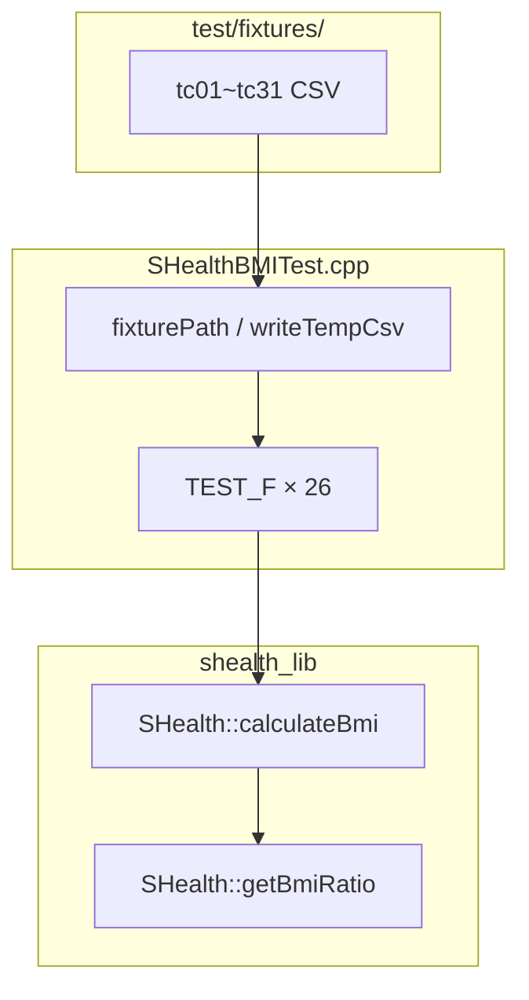

# SHealth BMI — 단위 테스트 구현 보고서 (3단계)

| 항목 | 내용 |
|------|------|
| 프로젝트 | SHealth BMI (삼성 헬스 연령대별 BMI 통계) |
| 기술 스택 | C++17, CMake 3.10+, Google Test v1.14 |
| 작성일 | 2026-05-20 |
| 보고 범위 | README 3단계 — **단위 테스트 구현** (계획 24건 + 인프라 2건) |
| 관점 | 시니어 C++ QA / TDD |
| 선행 문서 | [05_단위테스트계획.md](./05_단위테스트계획.md), [04_1차리팩토링.md](./04_1차리팩토링.md) |
| SSOT | [docs/test_plan.md](../docs/test_plan.md) |
| Git 브랜치 | `tc` |

---

## 요약

[05_단위테스트계획.md](./05_단위테스트계획.md)에 정의한 **TC 24건**을 `TEST_F` + `test/fixtures/` CSV로 구현했다. `SHealthBMITest.cpp`에 인프라 2건·비즈니스 24건을 추가했고, `calculateBmi` / `getBmiRatio` public API만으로 검증한다. `ctest` **26건 중 25건 Green**, **TC_16만 Red**(README `BMI≥25` 비만 vs 코드 `bmi>25`). README Activities **75~78**은 계획 대비 구현 완료이며, 3단계 README 체크는 **TC_16 Green 턴** 후 전체 Green으로 마무리할 수 있다.

---

## 1. 목표와 달성도

### 1.1 README Activities (3단계 — 구현)

| # | 항목 | TC | 계획 | 구현 | ctest |
|---|------|-----|:----:|:----:|:-----:|
| 75 | BMI 계산 로직 | 01~04, 05 | [x] | [x] | Green (05 스냅샷) |
| 76 | Age 평균치 보정 | 06~10 | [x] | [x] | Green |
| 77 | BMI 4분류 경계 | 11~18 | [x] | [x] | 17/18 Green, **16 Red** |
| 78 | 예외·경계 | 05, 22~26, 31 | [x] | [x] | Green |

### 1.2 산출물

| 산출물 | 경로 | 상태 |
|--------|------|:----:|
| 테스트 계획 SSOT | `docs/test_plan.md` | §9 0~4단계 **완료** |
| GTest 구현 | `src/test/cpp/SHealthBMITest.cpp` | **26 TEST_F** |
| CSV 픽스처 | `test/fixtures/tc*.csv` | **21개** (+ `_tmp/`) |
| CMake 픽스처 경로 | `SHEALTH_TEST_FIXTURE_DIR` | `CMakeLists.txt` |
| 계획 보고서 | `Report/05_단위테스트계획.md` | 완료 |
| **본 보고서** | `Report/06_단위테스트구현.md` | 완료 |

### 1.3 실행 결과

```text
ctest --output-on-failure
25/26 Passed (96%)
실패: SHealthBMITest.TC_16_Boundary_Obesity_25 (의도적 Red)
```

---

## 2. 구현 단계 요약 (`test_plan.md` §9)

| 단계 | 작업 | TC | 결과 |
|:----:|------|-----|------|
| 0 | `FAIL()` 제거, `TEST_F`, 헬퍼 | 인프라 2 | Green |
| 1 | BMI 계산 | 01~04 | Green |
| 2 | 체중 보정 | 06~10 | Green (07 스냅샷) |
| 3 | 분류 경계 | 11~18 | 17 Green, **16 Red** |
| 4 | 예외 | 05, 22~26, 31 | Green |
| 5 | TDD Green | **16** | **미착수** |
| 6 | 회귀·문서 | 18, 전체 | TC_16 Green 후 |

### 2.1 인프라 (0단계)

| 항목 | 내용 |
|------|------|
| 픽스처 클래스 | `class SHealthBMITest : public ::testing::Test` |
| 헬퍼 | `fixturePath()`, `writeTempCsv()`, `ratioSumForBand()`, `expectSingleBandCategory()` |
| 빌드 | `target_compile_definitions(SHEALTH_TEST_FIXTURE_DIR=...)` |
| 스텁 | `FailedTest` / `FAIL()` 제거 |

### 2.2 영역별 구현 하이라이트

| 영역 | 대표 TC | 검증 요약 |
|------|---------|-----------|
| BMI | 01 | 70kg/170cm → 과체중 100% |
| 보정 | 06 | 50,60,0 → 55, Normal≈66.7% |
| 분류 | 11~15, 17 | height=170, 경계 weight → 단일 분류 100% |
| 예외 | 24, 26 | 파일 없음→0, 빈 줄→파싱 중단 recordCount=1 |
| 재계산 | 31 | tc31_a(정상)→tc31_b(비만) 덮어쓰기 |

---

## 3. 테스트 구조



| 통계 | 값 |
|------|-----|
| `TEST_F` 총계 | 26 (인프라 2 + 비즈니스 24) |
| CSV 픽스처 | 21 |
| 허용 오차 | `EXPECT_NEAR(..., 1e-2)` |
| private 직접 호출 | 없음 (public API + CSV) |

---

## 4. Red / 스냅샷 TC

| TC | 유형 | 현재 동작 (스냅샷) | README / 목표 |
|----|------|-------------------|---------------|
| **16** | **Red** | weight=72.249 → 과체중 100% (비만 기대 실패) | BMI≥25 → 비만 |
| 07 | 스냅샷 | 전원 weight=0 → 0/0→NaN, 4분류 0% | 보정 정책 미정 |
| 05 | 스냅샷 | height=0 → BMI inf → **비만 100%** | F-10 Height 0 보정(4단계) |

### TC_16 Red 원인

```cpp
// SHealth.cpp — README는 >= 25 비만
if (bmi > kBmiOverweightMax) {  // 25.0은 None 또는 과체중
    return BmiClassSlot::Obesity;
}
```

**Green 턴:** `bmi >= kBmiOverweightMax`로 수정 → `tc16` weight `72.25` 재검증 → TC_18 회귀 확인.

### float 경계 보정 (테스트 데이터)

| TC | 계획 weight | 구현 weight | 사유 |
|----|-------------|-------------|------|
| 11 | 53.465 | **53.464** | 53.465는 float에서 BMI>18.5 → 정상 |
| 13 | 66.47 | **66.467** | BMI<23 보장 |
| 16 | 72.25 | **72.249** | Red 재현(과체중≠비만) |

---

## 5. TC 마스터 상태 (요약)

상세는 [docs/test_plan.md §3](../docs/test_plan.md) 참고.

| 상태 | TC ID | 건수 |
|------|-------|------|
| Implemented | 01~15, 17~18, 05, 22~26, 31, 06~10 | 23 |
| **Red** | **16** | 1 |
| Planned (로드맵) | 19~21, 27~30, 33~36 | 범위 외 |

---

## 6. AI 활용 요약

| 단계 | 활용 | 효과 |
|------|------|------|
| 계획 | PCTF + `test_plan.md` SSOT | [05](./05_단위테스트계획.md) |
| 0~4 구현 | §9 단계별 프롬프트 | 영역 단위 커밋·리뷰 용이 |
| Red 분리 | TC_16 실패 허용 | 버그 수정을 리팩토링과 분리 |
| 스냅샷 | TC_05·07 현재 동작 고정 | 4단계 F-10 전 회귀 기준선 |

---

## 7. 다음 단계

| 순서 | 작업 | 완료 조건 |
|:----:|------|-----------|
| 1 | **TC_16 Green** — `classifyBmi` `>= kBmiOverweightMax` | `ctest` 26/26 Green |
| 2 | TC_18·16 회귀 (`72.25` 경계) | §8 Red 해소 |
| 3 | README 3단계 체크 [x] | Activities 75~78 |
| 4 | `01_실습보고서.md` TC·정량 지표 갱신 | 5단계 회고 |
| 5 | README 4단계 기능 개선 | F-09~F-12, TC 33~36 |

### 권장 프롬프트 (TC_16 Green)

```
[P] 시니어 C++ QA (TDD Green)
[C] TC_16 Red. README F-05: BMI≥25 비만.
[T] classifyBmi만 >= kBmiOverweightMax. tc16 weight 72.25. ctest 전체 Green.
[F] diff + ctest + test_plan §3 TC_16 Implemented
```

---

## 8. 참고 문서

| 문서 | 용도 |
|------|------|
| [docs/test_plan.md](../docs/test_plan.md) | TC 상세·픽스처·Given-When-Then |
| [05_단위테스트계획.md](./05_단위테스트계획.md) | 3단계 계획 수립 회고 |
| [04_1차리팩토링.md](./04_1차리팩토링.md) | 선행 리팩토링·미수정 결함 |
| [Prompting/05_단위테스트계획.md](../Prompting/05_단위테스트계획.md) | 재사용 프롬프트 |
| [README.md](../README.md) | Activities·도메인 규칙 |

---

*작성 기준: `docs/test_plan.md` §9 0~4단계 완료, `ctest` 25/26 Green, `tc` 브랜치 구현 커밋.*
