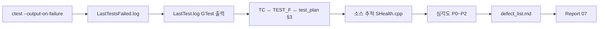

# SHealth BMI — 결함 분석 보고서 (3단계 후속)

| 항목 | 내용 |
|------|------|
| 프로젝트 | SHealth BMI (삼성 헬스 연령대별 BMI 통계) |
| 기술 스택 | C++17, CMake 3.10+, Google Test v1.14 |
| 작성일 | 2026-05-20 |
| 보고 범위 | **ctest 실패 로그 기반 결함 분석** — 위치 특정, 심각도 분류, 최소 수정안 |
| 관점 | 시니어 C++ QA / 결함 분석 |
| 선행 문서 | [06_단위테스트구현.md](./06_단위테스트구현.md), [05_단위테스트계획.md](./05_단위테스트계획.md) |
| SSOT | [docs/defect_list.md](../docs/defect_list.md), [docs/test_plan.md](../docs/test_plan.md) §8 |
| Git 브랜치 | `tc` |

---

## 요약

[06_단위테스트구현.md](./06_단위테스트구현.md) 완료 후 `ctest --output-on-failure` 결과(**25/26 Green**)와 `LastTest.log`를 근거로 결함을 추적했다. **확정 결함(P0) 1건(DEF-001)** — `SHealth::classifyBmi` 비만 경계 `>` vs README `≥25` — 과 **스냅샷·연쇄 3건**을 심각도별로 분류하고, 프로덕션 코드 **최소 1줄 수정안**을 도출했다. 상세·추적 매트릭스는 [docs/defect_list.md](../docs/defect_list.md)에 두었으며, **코드 수정은 미적용**(분석 턴) 상태다.

---

## 1. 목표와 달성도

### 1.1 분석 목표

| # | 목표 | 달성 |
|---|------|:----:|
| 1 | 실패 로그에서 버그 위치 특정 | [x] `SHealth.cpp:121` |
| 2 | 심각도 분류 (P0/P1/P2/연쇄) | [x] DEF-001~004 |
| 3 | 최소 수정 방안 도출 | [x] `>= kBmiOverweightMax` |
| 4 | `defect_list.md` 작성 | [x] `docs/defect_list.md` |
| 5 | 본 보고서 작성 | [x] `Report/07_결함분석.md` |

### 1.2 산출물

| 산출물 | 경로 | 상태 |
|--------|------|:----:|
| 결함 목록 SSOT | `docs/defect_list.md` | v1.0 |
| **본 보고서** | `Report/07_결함분석.md` | 완료 |
| 실패 로그 | `build/Testing/Temporary/LastTest.log` | TC_16 1건 |
| 프로덕션 수정 | `SHealth.cpp` | **미적용** |

### 1.3 ctest 기준선

```text
ctest --output-on-failure
96% tests passed, 1 tests failed out of 26

FAILED: 17 - SHealthBMITest.TC_16_Boundary_Obesity_25
```

| 구분 | 건수 |
|------|------|
| Passed | 25 |
| Failed (Red) | 1 (TC_16) |
| Open P0 | 1 (DEF-001) |

---

## 2. 분석 절차



| 단계 | 입력 | 출력 |
|------|------|------|
| 1 | `LastTestsFailed.log` | 실패 TEST_F: `TC_16_Boundary_Obesity_25` |
| 2 | GTest `Expected/Actual` | 비만(400) 100% vs 0% (`SHealthBMITest.cpp:124`) |
| 3 | 픽스처·BMI 역산 | weight 72.249 → BMI≈24.9997 |
| 4 | `classifyBmi` 분기 | L121 `bmi > 25` — 경계 25.0 제외 |
| 5 | `test_plan` §8·README | 명세 SSOT: BMI≥25 비만 |
| 6 | 스냅샷 TC | TC_07·05 Green이나 P1/P2 등록 |

---

## 3. 결함 마스터 (요약)

상세·로그 발췌·패치 초안은 [docs/defect_list.md](../docs/defect_list.md) 참고.

| DEF-ID | TC | 심각도 | 상태 | 한 줄 요약 |
|--------|-----|--------|------|------------|
| **DEF-001** | 16 | **P0** | **Confirmed (Red)** | 비만 조건 `>` → 25.0 미포함·TC_16 실패 |
| DEF-002 | 07 | P1 | Snapshot | `nonZeroWeightCount==0` 시 0/0 보정 |
| DEF-003 | 05 | P2 | Snapshot | height=0 → inf → 비만 100% (F-10 미구현) |
| DEF-004 | 18 | 연쇄 | Monitor (Green) | DEF-001 수정 후 4분류 합 100% 회귀 점검 |

### 3.1 심각도 기준 (본 프로젝트)

| 등급 | 기준 | ctest |
|------|------|-------|
| **P0** | README 명세 위반 + **실패** | Red |
| **P1** | 품질·명세 이슈, 스냅샷 **Green** | Green |
| **P2** | README 4단계(기능 개선) | Green |
| **연쇄** | P0 수정 시 영향 가능 | Green 또는 Red |

---

## 4. P0 상세 — DEF-001

### 4.1 실패 증상

```
SHealthBMITest.cpp:124: Failure
Expected getBmiRatio(20, Obesity) ≈ 100.0
Actual: 0
```

| 항목 | 값 |
|------|-----|
| 픽스처 | `test/fixtures/tc16_bmi_25.csv` |
| 입력 | age 25, weight **72.249**, height 170 |
| README 기대 | 20대 **비만(400) 100%** |
| 실제 집계 | **과체중(300)** 또는 None — 비만 0% |

### 4.2 근본 원인

```cpp
// SHealth.cpp L121 — DEF-001
if (bmi > kBmiOverweightMax) {   // 25.0은 비만 아님 → None 또는 과체중
    return BmiClassSlot::Obesity;
}
```

| BMI 값 | README | 현재 코드 |
|--------|--------|-----------|
| **25.0** | 비만 | `None` (분류 공백) |
| 24.9997 (tc16) | 비만(목표) | **과체중** (`23 ≤ bmi < 25`) |

상수 `kBmiOverweightMax = 25.0`은 [SHealth.h](../src/main/cpp/SHealth.h)에서 README와 일치한다. **연산자만 불일치**한다.

### 4.3 최소 수정안 (제안)

| 순서 | 대상 | 변경 | 규모 |
|:----:|------|------|------|
| 1 | `SHealth.cpp` L121 | `>` → `>= kBmiOverweightMax` | **1줄** |
| 2 (조건부) | `tc16_bmi_25.csv` | weight `72.249` → **`72.25`** | BMI=25.0 정합 |

**Green 완료 조건:** `ctest` **26/26**, TC_16·TC_18 통과, `test_plan` §8 Red 해소.

---

## 5. 스냅샷·연쇄 결함

### 5.1 DEF-002 — 연령대 전원 weight=0 (P1)

| 항목 | 내용 |
|------|------|
| 위치 | `imputeMissingWeightsByAgeBand` L98 |
| 동작 | `weightSum / nonZeroWeightCount` — 분모 0 |
| 테스트 | TC_07 — 4분류 0% 스냅샷, **Green** |
| 전략 | 요구 확정 후 Green; 3단계에서는 동작 고정 |

### 5.2 DEF-003 — height=0 (P2)

| 항목 | 내용 |
|------|------|
| 동작 | BMI `inf` → `bmi>25` → 비만 100% |
| 테스트 | TC_05 스냅샷, **Green** |
| 전략 | README §4 F-10 — **4단계 기능 개선** |

### 5.3 DEF-004 — TC_18 연쇄 (Monitor)

| 항목 | 내용 |
|------|------|
| 현재 | ctest **Green** (각 25%, 합 100%) |
| 위험 | `BmiClassSlot::None` 누락 시 합 &lt; 100% |
| 조치 | DEF-001 적용 직후 TC_18·TC_16 동시 회귀 |

---

## 6. test_plan · 요구사항 정합

| 문서 | TC_16 / BMI=25 |
|------|----------------|
| README / `.cursorrules` | **비만 (≥25)** |
| `docs/test_plan.md` §8 | Red → `classifyBmi` Green |
| `docs/requirements_analysis.md` | F-05, Red→Green |
| 현재 구현 | **미준수** (DEF-001 Open) |

**결함 SSOT:** README·`test_plan` — 구현 코드가 후행 수정 대상.

---

## 7. AI 활용 요약

| 단계 | 활용 | 효과 |
|------|------|------|
| 프롬프트 | PCTF — 결함 분석 전용, **코드 수정 금지** | 분석·수정 턴 분리 |
| 로그 | `ctest` + `LastTest.log` 자동 매핑 | TC_16 ↔ L121 즉시 연결 |
| 산출 | `defect_list.md` SSOT + Report 07 | Green 턴·실습 제출용 |
| 심각도 | Red vs 스냅샷 구분 | P0만 즉시 수정 대상 |

---

## 8. 다음 단계

| 순서 | 작업 | 완료 조건 | DEF |
|:----:|------|-----------|-----|
| 1 | **TC_16 Green** — `classifyBmi` `>=` | ctest 26/26 | DEF-001 |
| 2 | tc16 weight 72.25 검토 | TC_16 통과 | DEF-001 |
| 3 | TC_18 회귀 | 합≈100% | DEF-004 |
| 4 | `defect_list`·`test_plan` §8 갱신 | DEF-001 **Fixed** | — |
| 5 | README 3단계 체크 | Activities 75~78 [x] | — |
| 6 | DEF-002·003 | 요구 확정·4단계 | P1/P2 |

### 권장 프롬프트 (Green 턴)

```
[P] 시니어 C++ QA (TDD Green)
[C] docs/defect_list.md DEF-001
[T] classifyBmi L121만 bmi >= kBmiOverweightMax. 필요 시 tc16 weight 72.25.
[F] diff + ctest 26/26 + defect_list Fixed + test_plan §8 갱신
금지: DEF-002·003, 그 외 리팩토링
```

---

## 9. 참고 문서

| 문서 | 용도 |
|------|------|
| [docs/defect_list.md](../docs/defect_list.md) | 결함 마스터·로그·패치 초안 SSOT |
| [docs/test_plan.md](../docs/test_plan.md) | TC 상세·§8 Red/Green |
| [06_단위테스트구현.md](./06_단위테스트구현.md) | 25/26 구현·TC_16 Red 배경 |
| [05_단위테스트계획.md](./05_단위테스트계획.md) | Red 사전 식별 |
| [04_1차리팩토링.md](./04_1차리팩토링.md) | classifyBmi 추출·미수정 경계 |
| [README.md](../README.md) | 도메인 규칙·Activities |

---

*작성 기준: `ctest` 25/26, DEF-001 Open, `docs/defect_list.md` v1.0, `tc` 브랜치 커밋 `96a6731`.*
