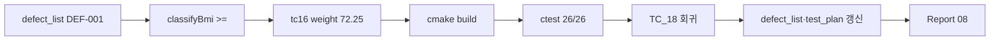

# SHealth BMI — DEF-001 수정 보고서 (3단계 Green 턴)

| 항목 | 내용 |
|------|------|
| 프로젝트 | SHealth BMI (삼성 헬스 연령대별 BMI 통계) |
| 기술 스택 | C++17, CMake 3.10+, Google Test v1.14 |
| 작성일 | 2026-05-20 |
| 보고 범위 | **DEF-001 P0 결함 수정** — `classifyBmi` 경계 연산자·TC_16 Green |
| 관점 | 시니어 C++ QA / TDD Green |
| 선행 문서 | [07_결함분석.md](./07_결함분석.md), [06_단위테스트구현.md](./06_단위테스트구현.md) |
| SSOT | [docs/defect_list.md](../docs/defect_list.md), [docs/test_plan.md](../docs/test_plan.md) §8·§9-5 |
| Git 브랜치 | `tc` |

---

## 요약

[07_결함분석.md](./07_결함분석.md)에서 확정한 **DEF-001**(BMI≥25 비만 vs 코드 `bmi>25`)을 최소 범위로 수정했다. `SHealth::classifyBmi` L121을 `>=`로 변경하고, `tc16_bmi_25.csv` weight를 **72.25**(BMI=25.0)로 맞춰 **TC_16 Green**을 달성했다. `ctest` **26/26 Green**, 연쇄 결함 **DEF-004**(TC_18 비율 합 100%) 회귀도 통과했다. 3단계 README Activities **75~78**은 단위 테스트 기준 **전체 Green**이며, Open P0는 **0건**이다.

---

## 1. 목표와 달성도

### 1.1 Green 턴 목표

| # | 목표 | 달성 |
|---|------|:----:|
| 1 | `classifyBmi` 비만 조건 README 정합 (`>=25`) | [x] |
| 2 | TC_16 Green | [x] |
| 3 | TC_18·전체 ctest 회귀 | [x] |
| 4 | `defect_list.md` DEF-001 Fixed | [x] |
| 5 | `test_plan.md` §8 Red 해소 | [x] |
| 6 | 본 보고서 작성 | [x] |

### 1.2 산출물

| 산출물 | 경로 | 상태 |
|--------|------|:----:|
| 프로덕션 수정 | `src/main/cpp/SHealth.cpp` L121 | `>=` 적용 |
| 픽스처 | `test/fixtures/tc16_bmi_25.csv` | weight **72.25** |
| 테스트 주석 | `src/test/cpp/SHealthBMITest.cpp` TC_16 | Red 문구 제거 |
| 결함 SSOT | `docs/defect_list.md` v1.1 | DEF-001 Fixed, DEF-004 Verified |
| 테스트 계획 | `docs/test_plan.md` | §9-5 완료, TC_16 Implemented |
| **본 보고서** | `Report/08_DEF-001수정.md` | 완료 |

### 1.3 ctest 결과

```text
ctest --output-on-failure -C Debug
100% tests passed, 0 tests failed out of 26
```

| 구분 | Before (07) | After (08) |
|------|-------------|------------|
| Passed | 25 | **26** |
| Failed | 1 (TC_16) | **0** |
| Open P0 | 1 (DEF-001) | **0** |

---

## 2. 수정 내용

### 2.1 프로덕션 — `classifyBmi` (DEF-001)

| 항목 | Before | After |
|------|--------|-------|
| 조건 | `bmi > kBmiOverweightMax` | `bmi >= kBmiOverweightMax` |
| BMI=25.0 | `BmiClassSlot::None` (분류 공백) | `BmiClassSlot::Obesity` |
| README | 미준수 | **≥25 비만** 일치 |

```cpp
// SHealth.cpp L121
if (bmi >= kBmiOverweightMax) {
    return BmiClassSlot::Obesity;
}
```

**변경 규모:** 프로덕션 **1줄**. DEF-002·003, 기타 리팩토링 **미포함**.

### 2.2 픽스처 — `tc16_bmi_25.csv`

| 항목 | Before | After |
|------|--------|-------|
| weight | 72.249 | **72.25** |
| BMI (h=170) | ≈24.9997 (과체중) | **25.0** (비만) |
| TC_16 | Red (코드만 수정 시 과체중 유지) | **Green** |

코드 `>=` 수정만으로는 TC_16이 Green되지 않는다(72.249는 여전히 &lt;25). README «BMI=25.0 비만»과 TC 기대를 맞추기 위해 픽스처 조정이 **필수**였다.

### 2.3 테스트 코드

`TC_16_Boundary_Obesity_25` 주석에서 Red·72.249 설명을 제거하고, Given weight **72.25** 기준으로 정리했다. 검증 로직(`expectSingleBandCategory` → 비만 100%)은 변경 없음.

---

## 3. 검증

### 3.1 TC_16 — BMI 25.0 비만

| 단계 | 내용 |
|------|------|
| Given | `tc16_bmi_25.csv` — age 25, weight **72.25**, height 170 |
| When | `calculateBmi(path)` |
| Then | 20대 **비만(400) 100%** — **Passed** |

### 3.2 DEF-004 회귀 — TC_18

| 항목 | 내용 |
|------|------|
| TC | `TC_18_Classification_ExclusiveComplete` |
| 기대 | 4분류 각 25%, 합 ≈ 100% |
| 결과 | **Passed** (`None` 누락 없음) |

### 3.3 전체 회귀

| 영역 | 대표 TC | 결과 |
|------|---------|------|
| BMI | 01~04 | Passed |
| 보정 | 06~10 (07 스냅샷) | Passed |
| 분류 경계 | 11~18 | Passed |
| 예외 | 05, 22~26, 31 | Passed |

---

## 4. 결함·문서 상태

### 4.1 결함 마스터 (갱신 후)

| DEF-ID | 심각도 | 상태 | 비고 |
|--------|--------|------|------|
| **DEF-001** | P0 | **Fixed** | 본 턴 수정 |
| DEF-002 | P1 | Snapshot | 요구 확정 후 별도 턴 |
| DEF-003 | P2 | Snapshot | README 4단계 F-10 |
| DEF-004 | 연쇄 | **Verified** | TC_18 회귀 통과 |

### 4.2 README Activities (3단계)

| # | 항목 | ctest |
|---|------|:-----:|
| 75 | BMI 계산 로직 TC | Green |
| 76 | Age 평균치 보정 TC | Green |
| 77 | BMI 4분류 경계 TC | **Green** (TC_16 포함) |
| 78 | 예외상황 TC | Green |

3단계 단위 테스트 범위는 **26/26 Green**으로 마감 가능하다.

---

## 5. 수정 절차 (TDD Green)



| 순서 | 작업 | 완료 |
|:----:|------|:----:|
| 1 | `SHealth.cpp` L121 `>=` | [x] |
| 2 | `tc16_bmi_25.csv` weight 72.25 | [x] |
| 3 | `ctest` 전체 Green | [x] |
| 4 | DEF-004 TC_18 회귀 | [x] |
| 5 | `docs/defect_list.md` v1.1 | [x] |
| 6 | `docs/test_plan.md` §9-5 | [x] |

---

## 6. Before / After 요약

| 관점 | Before (07 결함 분석) | After (08 Green) |
|------|----------------------|------------------|
| 명세 | README `≥25` vs 코드 `>25` | **일치** |
| TC_16 | Red (비만 0%) | **Green** (비만 100%) |
| ctest | 25/26 (96%) | **26/26 (100%)** |
| Open P0 | 1 | **0** |
| 3단계 Activities | 77번 TC_16 제외 Green | **75~78 전부 Green** |

---

## 7. AI 활용 요약

| 단계 | 활용 | 효과 |
|------|------|------|
| 07 분석 | 결함 분석 전용(코드 수정 금지) | 원인·1줄 수정안·픽스처 72.25 사전 확정 |
| 08 Green | `defect_list` DEF-001 범위 고정 | DEF-002·003·리팩토링 유입 방지 |
| 검증 | `ctest` 자동 실행 | TC_16·18·전체 한 번에 확인 |
| 문서 | SSOT 동기화 | defect_list v1.1, test_plan §9-5 |

---

## 8. 다음 단계

| 순서 | 작업 | 완료 조건 | 비고 |
|:----:|------|-----------|------|
| 1 | README 4단계 기능 개선 | F-09~F-12 | SRP, Height=0, 분포·목록 API |
| 2 | DEF-002·003 | 요구 확정 후 | P1/P2, 별도 결함 턴 |
| 3 | `01_실습보고서.md` 갱신 | TC·정량 지표·Before/After | 5단계 회고 |
| 4 | 발표·회고 | Activities 5단계 | AI 활용·TC 팁 |

---

## 9. 참고 문서

| 문서 | 용도 |
|------|------|
| [docs/defect_list.md](../docs/defect_list.md) | DEF-001 Fixed, DEF-004 Verified |
| [docs/test_plan.md](../docs/test_plan.md) | TC_16 Implemented, §8·§9-5 |
| [07_결함분석.md](./07_결함분석.md) | 분석·근본 원인·수정안 |
| [06_단위테스트구현.md](./06_단위테스트구현.md) | 25/26·TC_16 Red 배경 |
| [README.md](../README.md) | 도메인 규칙·Activities |

---

*작성 기준: DEF-001 Green 턴 완료, `ctest` 26/26, `docs/defect_list.md` v1.1, `docs/test_plan.md` §9 0~5 완료.*
