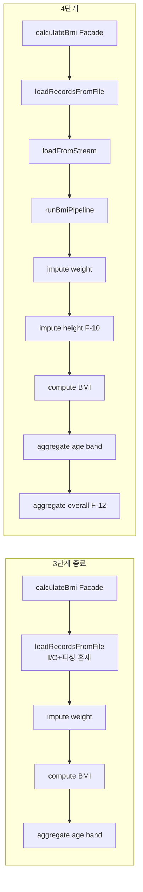

# SHealth BMI — 4단계 기능 개선 보고서

| 항목 | 내용 |
|------|------|
| 프로젝트 | SHealth BMI (삼성 헬스 연령대별 BMI 통계) |
| 기술 스택 | C++17, CMake 3.10+, Google Test v1.14 |
| 작성일 | 2026-05-20 |
| 보고 범위 | README **4. 기능 개선** 5항목 전체 (SRP · F-09~F-12) |
| 관점 | 시니어 C++ QA / 기능 추가·회귀 검증 |
| 선행 문서 | [08_DEF-001수정.md](./08_DEF-001수정.md), [04_1차리팩토링.md](./04_1차리팩토링.md) |
| SSOT | [docs/requirements_analysis.md](../docs/requirements_analysis.md), [docs/test_plan.md](../docs/test_plan.md), [docs/defect_list.md](../docs/defect_list.md) |
| Git 브랜치 | `feature` (`a1a887a` ~ `b3761ad`) |

---

## 요약

3단계 **ctest 26/26 Green** 이후 README 4단계를 순차 구현했다. **SRP**로 파일 I/O·파싱·도메인 파이프라인을 분리하고, **F-09** 연령대 분포 API, **F-10** height=0 보정(DEF-003 Fixed), **F-11** 정상 BMI 사용자 ID 목록, **F-12** 전체 인원 4분류 비율 API를 추가했다. 기존 `calculateBmi`·`getBmiRatio` 시그니처는 유지하며, **ctest 31/31 Green**·**main 3종 출력(연령대·전체·정상 목록)** 검증을 완료했다.

---

## 1. 목표와 달성도

### 1.1 README Activities (4단계, README 82~87행)

| # | README 항목 | 요구 ID | README | 핵심 산출 |
|---|-------------|---------|:------:|-----------|
| 1 | SRP에 따른 책임 분리 등 리팩토링 | — | [x] | `loadFromStream`, `runBmiPipeline` Facade |
| 2 | 특정 연령대의 BMI 분포 비율 계산 | F-09 | [x] | `getAgeBandDistribution(ageClass)` |
| 3 | Height가 0인 경우 평균치 보정 | F-10 | [x] | `imputeMissingHeightsByAgeBand`, DEF-003 Fixed |
| 4 | BMI 정상 범위 사용자 목록 조회 | F-11 | [x] | `getNormalBmiUserIds()` |
| 5 | 전체 사용자 대비 각 BMI 범주 비율 | F-12 | [x] | `getOverallBmiDistribution()` |

**달성:** Activities 4단계 **5/5 완료**.

### 1.2 제약 준수

| 제약 | 준수 |
|------|:----:|
| `classifyBmi`·DEF-001 재수정 금지 | ○ |
| F-09 public API 시그니처 유지 | ○ |
| God Method 전면 재작성·대규모 `vector` 전환 금지 | ○ |
| 한 턴·한 축 (기능별 커밋 분리) | ○ |

### 1.3 ctest 결과

```text
cd build
ctest --output-on-failure
100% tests passed, 0 tests failed out of 31
Total Test time (real) = 0.54 sec
```

| 구분 | 3단계 종료 (08) | 4단계 종료 (09) |
|------|-----------------|-----------------|
| TEST_F | 26 | **31** |
| Passed | 26 | **31** |
| Failed | 0 | **0** |
| Open P0 | 0 | **0** |
| DEF-003 | Snapshot | **Fixed** |

---

## 2. 아키텍처 Before / After

### 2.1 파이프라인



### 2.2 public API 확장

| API | 단계 | 용도 |
|-----|------|------|
| `int calculateBmi(filename)` | 기존 | 로드·파이프라인·`recordCount` |
| `double getBmiRatio(ageClass, type)` | 기존 | 연령대·분류 코드(100~400) % |
| `AgeBandDistribution getAgeBandDistribution(ageClass)` | F-09 | 연령대 4분류 % 일괄 조회 |
| `std::vector<int> getNormalBmiUserIds()` | F-11 | 정상 BMI 사용자 ID |
| `OverallBmiDistribution getOverallBmiDistribution()` | F-12 | 전체 인원 4분류 % |

---

## 3. 항목별 구현 상세

### 3.1 SRP — 책임 분리

| 책임 | 메서드 | 설명 |
|------|--------|------|
| Facade | `calculateBmi` | 로드 실패 시 0, 성공 시 `runBmiPipeline()` |
| 파일 I/O | `loadRecordsFromFile` | `ifstream` 열기·오류만 |
| 파싱 (DIP) | `loadFromStream` | 헤더 스킵·`parseAndStoreLine` |
| 파이프라인 | `runBmiPipeline` | 보정 → BMI → 집계 |

**효과:** 디스크 없는 `istream` 테스트(TC 32 로드맵) 및 Parser 레이어 분리 기반 마련.

### 3.2 F-09 — 연령대 BMI 분포 (`getAgeBandDistribution`)

- `struct AgeBandDistribution` — 4분류 % 한 번에 반환
- `getBmiRatio`는 내부에서 `getAgeBandDistribution` 위임 (단일 코드 경로)
- 유효 `ageClass`: 20, 30, …, 70 — 그 외 전부 0.0
- **TC:** `TC_33_GetAgeBandDistribution_ThreeCategories` (`tc33_three_categories_20s.csv`)

### 3.3 F-10 — height=0 보정 (`imputeMissingHeightsByAgeBand`)

| 규칙 | 내용 |
|------|------|
| 대상 | `height == kMissingHeight (0.0)` |
| 보정값 | 동 연령대 `[a, a+10)` 내 `height != 0` 산술 평균 |
| 순서 | weight 보정 **후** height 보정 **후** `computeAllBmis` |
| 가드 | `nonZeroHeightCount == 0` → 해당 연령대 skip |

**결함:** DEF-003 **Fixed** ([defect_list.md](../docs/defect_list.md) v1.2)

| TC | 시나리오 | 기대 |
|----|----------|------|
| TC_05 | 20대 1명 height=0, 표본 없음 | 보정 생략 → 비만 100% (엣지) |
| TC_34 | 170 / 0 / 180 | 0행 → 175.0, Normal 100% |

### 3.4 F-11 — 정상 BMI 사용자 목록 (`getNormalBmiUserIds`)

- CSV `id` 컬럼 파싱 (`kCsvColId = 0`, `ids[]` 배열)
- 분류: `classifyBmi` **Normal** 슬롯 (`18.5 < BMI < 23`)
- `calculateBmi` 전 호출 시 빈 벡터
- **TC:** `TC_35_GetNormalBmiUserIds_TwoOfThree` (`tc35_normal_bmi_users.csv`)

### 3.5 F-12 — 전체 BMI 범주 비율 (`getOverallBmiDistribution`)

| 규칙 | 내용 |
|------|------|
| 집계 범위 | 로드된 **전체** `recordCount` |
| 공식 | `(count / total) * 100` |
| `recordCount==0` | 4분류 모두 0.0 |

**공통 헬퍼 추출** (연령대·전체 중복 제거):

- `incrementClassificationCount`
- `fillRatiosFromCounts` (`memberCount==0` 가드)

| TC | 시나리오 | 기대 |
|----|----------|------|
| TC_36 | tc18 4명 4분류 | 전체 각 25%, 합≈100 |
| TC_37 | tc25 빈 CSV + tc18 회귀 | 전체 0%; 연령대·전체 합≈100% |

---

## 4. main 출력 검증 (`SHealthBMI.cpp`)

### 4.1 실행 방법

```powershell
cd build
.\SHealthBMI.exe   # shealth.dat 기준 (프로젝트 루트 또는 build 복사본)
```

### 4.2 출력 형식

| 블록 | 형식 | F-요구 |
|------|------|--------|
| 연령대 분포 | `{20\|30\|…\|70} - underweight = …, normal = …, …` | F-09 |
| 전체 비율 | `Overall - underweight = …, …` | F-12 |
| 정상 목록 | `Normal BMI users (N): id1 id2 …` | F-11 |

### 4.3 실측 결과 (`shealth.dat`, 2026-05-20)

```text
20 - underweight = 3.511053, normal = 23.797139, overweight = 11.833550, obesity = 60.858257
30 - underweight = 1.863354, normal = 15.527950, overweight = 10.062112, obesity = 72.546584
40 - underweight = 0.521512, normal = 10.039113, overweight = 9.126467, obesity = 80.312907
50 - underweight = 2.181401, normal = 12.629162, overweight = 9.988519, obesity = 75.200918
60 - underweight = 0.862895, normal = 8.533078, overweight = 10.642378, obesity = 79.961649
70 - underweight = 0.529101, normal = 12.345679, overweight = 10.758377, obesity = 76.366843
Overall - underweight = 1.596848, normal = 13.562837, overweight = 10.389880, obesity = 74.450436
Normal BMI users (654): 93711 93715 93718 … (이하 ID 나열)
```

| 검증 항목 | 결과 |
|-----------|------|
| 연령대 6구간(20~70) 출력 | ○ |
| 연령대별 4분류 합 ≈ 100% (예: 20대 ≈ 100.00%) | ○ |
| Overall 4분류 합 ≈ 100% | ○ |
| 정상 BMI 사용자 수·ID 목록 | ○ (654명) |
| exit code | 0 |

---

## 5. 테스트 매핑 (4단계 신규)

| TC | 기능 | 픽스처 | 검증 포인트 |
|----|------|--------|-------------|
| TC_33 | F-09 | `tc33_three_categories_20s.csv` | 3분류 각 ~33.33%, 합≈100 |
| TC_34 | F-10 | `tc34_impute_heights.csv` | height 0 → 175.0 보정 |
| TC_35 | F-11 | `tc35_normal_bmi_users.csv` | 정상 ID 2건 {102,103} |
| TC_36 | F-12 | `tc18_four_categories.csv` | 전체 4분류 합≈100 |
| TC_37 | F-12 | `tc25` + `tc18` | recordCount=0 → 0%; 회귀 |

---

## 6. 변경 파일 목록

### 6.1 소스·테스트

| 경로 | 변경 내용 |
|------|-----------|
| `src/main/cpp/SHealth.h` | `AgeBandDistribution`, `OverallBmiDistribution`, F-09~F-12 API |
| `src/main/cpp/SHealth.cpp` | SRP 분리, height 보정, 집계·조회 API |
| `src/main/cpp/SHealthBMI.cpp` | main: 연령대·Overall·정상 목록 출력 |
| `src/test/cpp/SHealthBMITest.cpp` | TC_33~TC_37 |

### 6.2 픽스처

| 경로 |
|------|
| `test/fixtures/tc33_three_categories_20s.csv` |
| `test/fixtures/tc34_impute_heights.csv` |
| `test/fixtures/tc35_normal_bmi_users.csv` |

### 6.3 문서

| 경로 |
|------|
| `README.md` (§4 체크 [x]) |
| `docs/defect_list.md` (DEF-003 Fixed) |
| `Report/09_기능개선.md` (본 문서) |
| `Report/README.md` |
| `Prompting/09_기능개선.md` |

---

## 7. Git 커밋 이력 (`feature`)

| 커밋 | 메시지 |
|------|--------|
| `a1a887a` | refactor: SRP 분리 — loadFromStream, runBmiPipeline Facade |
| `a6b2872` | feat: F-09 연령대 BMI 분포 API getAgeBandDistribution |
| `af311c7` | feat: F-10 height=0 연령대 평균 키 보정 (DEF-003 Fixed) |
| `1875b2d` | feat: F-11 정상 BMI 사용자 ID 목록 조회 API |
| `b3761ad` | feat: F-12 전체 BMI 범주 비율 API 및 4단계 문서 |

**상태:** `feature` 브랜치, `origin/feature` 동기, working tree clean.

---

## 8. 완료 검증 체크리스트

| # | 검증 항목 | 방법 | 결과 |
|---|-----------|------|:----:|
| 1 | README §4 5항목 [x] | README 82~87행 | ○ |
| 2 | ctest 전체 Green | `ctest --output-on-failure` | **31/31** |
| 3 | 연령대 분포 출력 | `SHealthBMI.exe` | ○ |
| 4 | 전체 BMI 비율 출력 | `Overall - …` | ○ |
| 5 | 정상 사용자 목록 | `Normal BMI users (N):` | ○ |
| 6 | 3단계 회귀 | TC_01~TC_31 포함 | ○ |

---

## 9. 잔여·모니터링

| ID | 항목 | 상태 | 비고 |
|----|------|------|------|
| DEF-002 | 연령대 전원 weight=0 | Snapshot | `nonZeroWeightCount==0` 가드는 별도 턴 |
| DEF-004 | TC_18 비율 합 100% | Verified | TC_36·TC_37 회귀 포함 |
| TC 32 | `istream` 픽스처 테스트 | 로드맵 | SRP `loadFromStream` 기반 |

---

## 10. 5단계(회고) 연계

README 5단계 체크리스트는 [01_실습보고서.md](./01_실습보고서.md)에서 갱신 예정이다. 본 4단계 보고서를 근거로 다음을 정리할 수 있다.

- **목표·달성도:** Activities 4단계 5/5 완료, ctest 31/31
- **Before & After:** God Method → Facade + 5개 public 조회 API
- **TC 영향:** 기능별 TC 추가(TC_33~37)로 회귀·명세 고정
- **AI 활용:** `[P][C][T][F][금지]` 프롬프트 단위로 범위 통제

---

## 참고

| 문서 | 용도 |
|------|------|
| [docs/requirements_analysis.md](../docs/requirements_analysis.md) | F-09~F-12, TC 33~37 원문 |
| [docs/test_plan.md](../docs/test_plan.md) | TC 상세·Red/Green |
| [docs/defect_list.md](../docs/defect_list.md) | DEF-003 Fixed |
| [docs/code_quality_report.md](../docs/code_quality_report.md) | SRP·DIP 로드맵 |
| [Prompting/09_기능개선.md](../Prompting/09_기능개선.md) | 4단계 세션 프롬프트 아카이브 |

---

*작성 기준: 4단계 기능 개선 완료 검증, `ctest` 31/31 Green, `feature` @ `b3761ad`.*
