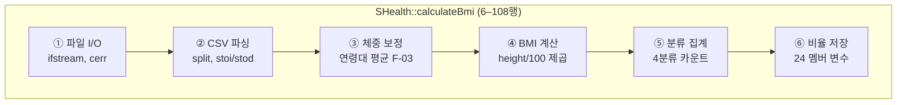

# SHealth BMI — SOLID & Code Smell 분석 보고서

> **관점**: 시니어 C++ QA / 소프트웨어 설계 리뷰어  
> **대상**: SHealth BMI C++17 (CMake, Google Test), 레거시 `SHealth` 단일 클래스  
> **근거**: [README.md](../README.md), [.cursorrules](../.cursorrules), [requirements_analysis.md](./requirements_analysis.md), `src/main/cpp/*`  
> **범위**: 분석만 — 코드 수정·리팩토링 미수행

---

## 1) SOLID 원칙 위반 분석

| 원칙 | 위반 여부 | 파일·라인 | 근거 | 영향 |
|:----:|:---------:|-----------|------|------|
| **S** — Single Responsibility | **위반** | `SHealth.cpp` 6–108행 `calculateBmi` | 파일 I/O, CSV 파싱, 체중 보정, BMI 계산, 분류 집계, 멤버 변수 갱신을 한 메서드에서 수행 | 단위 테스트 불가, 변경 시 회귀 범위 전체, F-09~F-12 확장 시 메서드 비대화 |
| **S** | **위반** | `SHealth.h` 6–28행 전체 클래스 | Parser·Domain·Statistics·Presentation이 단일 `SHealth`에 혼재 | 레이어별 교체·모킹 불가 |
| **O** — Open/Closed | **위반** | `SHealth.cpp` 76–106행 | 연령대 `a`마다 `if (a==20)…else if (a==70)`로 24개 멤버에 수동 매핑 | 80대 추가·분류 5종 추가 시 분기·멤버 폭발, 기존 코드 전면 수정 |
| **O** | **위반** | `SHealth.cpp` 111–136행 `getBmiRatio` | 24중첩 `if-else` + 매직 넘버 `100/200/300/400` | 새 분류·연령대마다 분기 추가 (확장에 닫혀 있지 않음) |
| **L** — Liskov Substitution | **해당 없음** | — | 상속·다형성 미사용 | — |
| **I** — Interface Segregation | **위반** | `SHealth.h` 8–9행 public API | `calculateBmi`(파일+전처리)와 `getBmiRatio`(조회)만 노출, 순수 도메인 API 부재 | 클라이언트가 파일 경로·전체 파이프라인에 강결합; 테스트는 통합 수준만 가능 |
| **I** | **부분 위반** | `SHealth.h` 11–25행 | 24개 비율 멤버 + 4개 배열이 한 타입에 노출·캡슐화 | 호출자가 내부 상태 모델에 의존 (`getBmiRatio` 매직 코드) |
| **D** — Dependency Inversion | **위반** | `SHealth.cpp` 8–12, 10행 | `std::ifstream`·`std::cerr`에 직접 의존 | 스트림·로거 주입 불가, 메모리 CSV·목 테스트 불가 (TC 32) |
| **D** | **위반** | `SHealthBMI.cpp` 6행 | `calculateBmi("shealth.dat")` 하드코딩 | 경로·데이터 소스 교체 시 main 수정 필요 |

### SOLID 종합 표 (요청 형식)

| 문제점 | 위반 원칙/스멜 | 영향 | 개선 방향 | 우선순위 |
|--------|----------------|------|-----------|:--------:|
| `calculateBmi` God Method (I/O~집계 일괄) | **SRP**, Long Method | TC 1~18 단위 검증 불가, 리팩터 비용 극대 | `loadFromStream` / `imputeWeightByAgeBand` / `computeBmi` / `aggregateByAgeBand` 분리 | P0 |
| 24개 연령대×분류 멤버 + if-else 매핑 | **OCP**, Data Clumps | F-09·F-12 시 코드 폭증 | `AgeBandStats` 또는 `map<AgeBand, map<BmiCategory,double>>` | P1 |
| `getBmiRatio(ageClass, type)` 매직 넘버 API | **ISP**, **OCP** | API 의미 불명, 잘못된 type 무방비 | `enum class BmiCategory`, `getRatio(AgeBand, BmiCategory)` | P1 |
| 파일·stderr 직접 사용 | **DIP** | 디스크 없는 GTest, 로그 정책 변경 불가 | `istream&` 주입, 에러는 반환값·`optional` | P0 |
| main의 `printf`·하드코드 경로 | **SRP**, **DIP** | UI가 App 레이어에만 있어야 하나 포맷 중복 | `SHealthBMI.cpp`는 조립·출력만, 계산은 라이브러리 | P2 |
| 상속 미사용 | **LSP** N/A | — | 분리 시 컴포지션·순수 함수 우선 (불필요한 상속 금지) | — |

---

## 2) Code Smell 목록 (Martin Fowler + P0/P1/P2)

| 문제점 | 위반 원칙/스멜 (Fowler) | 영향 | 개선 방향 | 우선순위 |
|--------|-------------------------|------|-----------|:--------:|
| `calculateBmi` ~100줄, 4단계 파이프라인 | **Long Method** | 가독성·테스트성 저하 | 단계별 private 메서드 또는 free function 추출 | P0 |
| `SHealth` — 로드·도메인·통계·캐시 | **Large Class** | 단일 변경이 전 클래스에 파급 | Parser / Domain / Statistics 타입 분리 준비 | P0 |
| 연령대 루프·분류 if·`getBmiRatio` 분기 | **Duplicated Code** | DRY 위반, 버그 복제 (BMI=25) | `classifyBmi`, `ageBandStart`, 집계 테이블 단일화 | P0 |
| `18.5`, `23`, `25`, `20~70`, `100/200/300/400` | **Magic Number** | README 경계와 불일치 시 찾기 어려움 | `constexpr` 상수, `enum class` | P1 |
| `ages[10000]` 등 C 배열 + `count` | **Primitive Obsession**, **Fixed Size** | 10000건 초과 UB, STL 미활용 | `std::vector<UserRecord>` (테스트 Green 후) | P1 |
| 24× `underweight20`…`obesity70` | **Data Clumps** | 멤버·생성자·직렬화 부담 | `struct AgeBandRatio { double uw, n, ow, ob; }` | P2 |
| `tokens[1]`,`[2]`,`[3]` 컬럼 인덱스 | **Magic Number** | CSV 스키마 변경 시 파싱 깨짐 | named constant / `UserRecord` 파싱 | P1 |
| `sum / ageCount`, `* 100 / sum` | **Division by Zero** (스멜+결함) | NaN/inf 또는 크래시 | `ageCount==0`, `sum==0` 가드 + TC 7, 20 | P0 |
| BMI=25: `bmis[i] > 25`만 비만 | **Bug / Incomplete Logic** | 25.0 사용자 미분류, 통계 왜곡 | `>= 25.0` (README F-05) | P0 |
| `height==0` 미처리 | **Missing Branch** | inf/NaN BMI, 분류 오염 | F-10 전까지 TC 5로 명세 고정 | P1 |
| 19세·75세·80세+ 미포함 | **Incomplete Domain** | 샘플 id 93709 등 통계 제외 | `ageBandStart` + TC (문서화) | P2 |
| `std::cerr` in library, `printf` in main | **Inappropriate Intimacy** | I/O 책임 혼재 | 라이브러리는 로깅 없이 결과 코드 반환 | P2 |
| `split`만 분리, 나머지 monolith | **Lazy Class** (반대: God Method) | 추출 패턴 불완전 | 동일 수준으로 보정·분류 추출 | P0 |
| `getBmiRatio` 26분기 | **Long Parameter List** + **Switch Statements** | 유지보수 지옥 | map 또는 테이블 조회 | P1 |
| `SHealthBMITest` `FAIL()` 스텁 | **Ignored Test** | Green 게이트 미충족 | TC 37 — 스텁 제거 후 점진 추가 | P0 |
| 파싱 실패 시 `break` (18–19행) | **Ambiguous Behavior** | 첫 bad line 이후 전체 중단 | skip vs throw 정책 + TC 26 | P1 |
| `count++` without bounds check | **Array Overflow** | >10000 레코드 UB | TC 29, `vector` 또는 상한 검사 | P1 |

### P0 / P1 / P2 요약

| 우선순위 | 건수 | 대표 이슈 |
|:--------:|:----:|-----------|
| **P0** | 8 | God Method, BMI=25, 0 나눗셈, DIP(파일), 중복 분류 로직, FAIL 스텁 |
| **P1** | 9 | 매직 넘버, 고정 배열, `getBmiRatio`, height=0, 파싱 정책, 오버플로 |
| **P2** | 5 | 24 멤버 변수, printf/main, 연령대 밖 연령, I/O 혼용 |

---

## 3) God Method `calculateBmi` 책임 분해

### 3.1 현재 구조 (단일 메서드)

| 블록 | 행 | 책임 | 부수효과 |
|------|-----|------|----------|
| ① 로드 | 7–26 | 파일 열기, 헤더 스킵, 배열 적재 | `count`, `ages[]`, `weights[]`, `heights[]` |
| ② — | 17–24 | 라인→토큰 (내부 `split`) | 파싱 실패 시 `break` |
| ③ 보정 | 28–48 | 연령대별 weight=0 → 평균 | `weights[]` 변경, `ageCount==0` 위험 |
| ④ BMI | 50–53 | BMI 배열 계산 | `bmis[]`, height=0 시 inf |
| ⑤⑥ 통계 | 55–107 | 분류·백분율 | 24개 `double` 멤버 |

### 3.2 목표 레이어 (테스트 가능 구조)

| 레이어 | 책임 | 제안 API (구현 X) | 현재 위치 |
|--------|------|-------------------|-----------|
| **Parser** | CSV → 레코드 | `UserRecord parseLine(const string&)`, `vector<UserRecord> loadFromStream(istream&)` | ①② |
| **Domain** | BMI·분류·보정 | `double computeBmi(kg, cm)`, `BmiCategory classifyBmi(double)`, `void imputeWeightByAgeBand(vector<UserRecord>&)` | ③④ |
| **Statistics** | 집계·비율 | `AgeBandStats aggregate(const vector<UserRecord>&)`, `double ratioPercent(int cnt, int total)` | ⑤⑥ |
| **App** | 경로·출력 | `main`: 파일 경로, `calculate` 호출, 리포트 `printf` | `SHealthBMI.cpp` |

**과도기 전략**: `SHealth::calculateBmi`는 **Facade**로 유지하되, 내부를 private 메서드로만 쪼개도 TC 32(istream) 전까지 단위 테스트 가능성이 크게 개선된다.

---

## 4) README 도메인과의 불일치

| 문제점 | README / F-ID | 코드 위치 | 불일치 내용 | 영향 | 개선 방향 | 우선순위 |
|--------|---------------|-----------|-------------|------|-----------|:--------:|
| BMI=25 미분류 | F-05: ≥25 비만 | `SHealth.cpp` 71행 `> 25` | 25.0은 어떤 분류에도 미포함 | 비만 비율 과소, 합계 &lt; 100% | `>= 25.0` + TC 16 | P0 |
| BMI 경계 18.5 | ≤18.5 저체중 | 65행 `<= 18.5` | 일치 | — | 상수 `kBmiUnderMax` | P1 |
| 정상 (18.5, 23) | 18.5 초과 ~ 23 미만 | 67행 `>18.5 && <23` | 일치 | — | — | — |
| 과체중 [23, 25) | 23 이상 25 미만 | 69행 `>=23 && <25` | 일치 | — | — | — |
| 체중 0 보정 | F-03 | 28–47행 | 로직 일치, `ageCount==0` 미방어 | 0 나눗셈 | TC 7, 가드 | P0 |
| 키 0 보정 | F-10 (4단계 예정) | 52행 | 미구현 → height=0 시 div-by-zero | inf/NaN BMI | 3단계에서 F-10, TC 5·33 | P1 |
| 연령대 20~70 | F-02 | 29, 56행 루프 | 75세(93709) 등 제외 | 통계 누락 | `ageBandStart` 문서화 | P2 |
| 연령대 비율 합 100% | F-06 | 65–73 + BMI=25 버그 | 분류 누락 시 합 &lt; 100% | 리포트 신뢰도 하락 | TC 16, 18, 36 | P0 |
| `sum==0` 연령대 | F-06 | 77–105행 | 0 나눗셈 | NaN 출력 가능 | TC 20 | P0 |
| 파일 없음 | F-01 | 9–11행 | 반환 0 + cerr | 일치 | TC 24 | — |
| 레코드 상한 | — | 21–24행 | 10000 초과 검증 없음 | UB | TC 29 | P1 |

---

## 5) 1차 리팩토링 로드맵 (구현 순서만)

`.cursorrules` 진행 순서: **리팩토링 → 단위 테스트 → 기능 개선**. 아래는 **1단계 리팩토링** 범위만 해당한다.

| 순서 | 작업 | 대상 | 금지 사항 |
|:----:|------|------|-----------|
| **0** | Green 게이트 | `SHealthBMITest.cpp` | `FAIL()` 스텁 제거 또는 skip 정책 확정 (TC 37) |
| **1** | **네이밍** | `sum`→`bandMemberCount`, `a`→`ageBandStart`, `type`→의미 있는 enum 이름 | API 시그니처 변경은 테스트 동반 시만 |
| **2** | **매직 넘버 상수화** | 18.5, 23, 25, 20~70 step 10, 100/200/300/400, CSV 인덱스 | 동작 변경 없이 치환만 |
| **3** | **함수 추출** (private) | `loadRecords`, `imputeMissingWeights`, `computeAllBmis`, `classifyAndStoreRatios`, `classifyBmi` | public API 유지 |
| **4** | **반복/중복 제거** | 76–106 `if (a==20)…` → 루프+테이블; `getBmiRatio` 분기 축소 | 24 멤버 → struct/map는 한 PR에 한 종류 |
| **5** | **SRP 준비** | `istream` 오버로드 또는 `loadFromStream` 추가; `calculateBmi`는 Facade | F-09~F-12 신기능 구현 금지 |
| **6** | **버그 수정** (테스트 선행) | BMI `>=25`, `ageCount==0`, `sum==0` | TC 16, 7, 20 먼저 Red→Green |

**한 턴·한 축 원칙**: 2와 6은 분리 (상수화 vs 경계 버그). 버그 수정은 반드시 TC 16 등 **테스트 먼저**.

---

## 6) Code Smell ↔ Google Test 연계

| 문제점 / 스멜 | 대응 TC | 비고 |
|---------------|:-------:|------|
| BMI 계산 로직 (Long Method 내 블록) | 1, 2, 3, 4 | 분리 후 `computeBmi` 직접 호출 |
| height=0 | 5 | F-10 전 명세 확정 |
| 체중 0 보정 | 6, 7, 8, 9, 10 | 7=ageCount==0 |
| BMI 분류 경계 | 11–18 | **16**=BMI 25.0 (현재 Red 예상) |
| 연령대 비율·`getBmiRatio` | 19–23 | 21=매직 넘버 API 검증 |
| 파일·파싱 | 24–28 | God Method I/O 블록 |
| 오버플로·음수·재호출 | 29–31 | |
| istream 주입 (DIP) | 32 | SRP 분리 후 |
| F-10~F-12 (3단계) | 33–36 | 1차 리팩토링 범위 외 |
| FAIL 스텁 | 37 | Green 게이트 |
| 픽스처 인프라 | 38, 39 | |

### 스멜별 TC 매핑 (상세)

| # | 스멜/문제 | TC 번호 |
|---|-----------|---------|
| 1 | God Method — BMI 블록 | 1–4, 32 |
| 2 | God Method — 보정 블록 | 6–10 |
| 3 | God Method — 분류 블록 | 11–18 |
| 4 | God Method — I/O·파싱 | 24–28 |
| 5 | BMI=25 버그 | **16**, 18, 36 |
| 6 | ageCount==0 | **7** |
| 7 | sum==0 (연령대 인원 0) | **20** |
| 8 | getBmiRatio 매직 넘버 | 21, 22, 23 |
| 9 | 고정 배열 10000 | **29** |
| 10 | height=0 | 5, 33 |
| 11 | 중복 분류 로직 | 11–18 (단일 `classifyBmi`로 통합 후 동일 TC) |
| 12 | Ignored Test | **37** |
| 13 | main printf / App SRP | (통합) 27, 19 — 리팩터 후 출력 포맷 TC 선택적 |
| 14 | 연령대 밖 연령 | (문서) + 19 커스텀 CSV |
| 15 | 24 Data Clumps | 19, 21, 36 |

---

## 개선 방향 요약

1. **P0 먼저**: God Method 내부를 단계별 private 추출 + **BMI≥25**·**0 나눗셈**은 TC 16·7·20으로 고정한 뒤 수정.  
2. **테스트 가능성**: 파일 I/O를 `istream&`로 끌어내어 Parser 레이어를 분리하면 TC 1–23의 대부분을 디스크 없이 실행 가능 (TC 32).  
3. **SOLID**: SRP·OCP·DIP 위반이 핵심; LSP는 해당 없음. 상속보다 **순수 함수 + 컴포지션**.  
4. **1차 리팩토링**: 네이밍 → 상수화 → 추출 → 중복 제거 → SRP 준비 순; **24 멤버 구조 변경은 한 번에 한 종류**.  
5. **Green 게이트**: `FAIL()` 스텁(TC 37) 해소 전 대규모 구조 변경 금지 (`.cursorrules`).  
6. **3단계 연계**: F-10(height=0), F-11(목록), F-12(전체 비율)는 SRP 분리·TC Green 이후.

---

## 참고

| 문서 | 용도 |
|------|------|
| [requirements_analysis.md](./requirements_analysis.md) | F-01~F-12, TC 1~39 전체 |
| [.cursorrules](../.cursorrules) | 단계별 금지·Green 게이트 |
| [README.md](../README.md) | Activities 1단계 체크리스트 |

---

*생성: README·`src/main/cpp` 현행 코드 기준. 리팩터링·TC 추가 시 본 문서와 동기화할 것.*
