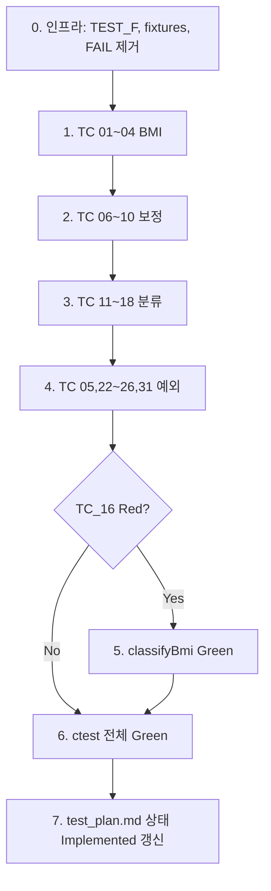

# SHealth BMI — 단위 테스트 계획

| 항목 | 내용 |
|------|------|
| 문서 버전 | 1.0 |
| 작성 기준 | README Activities §3, `docs/requirements_analysis.md` §4, `.cursorrules` |
| 대상 코드 | `SHealth.h`, `SHealth.cpp` (`shealth_lib`) |
| 구현 상태 | **0단계 완료** — `TEST_F` 골격·헬퍼·`test/fixtures/`; 비즈니스 TC(01~31) Planned |

---

## 1. 개요

### 1.1 목표

- README 75~78 항목에 대응하는 **Google Test 단위 테스트**를 설계한다.
- BMI 계산(F-04), 연령대 체중 보정(F-03), BMI 분류(F-05), 예외·경계(F-01, F-06, F-07)를 **결정론적 소형 픽스처**로 검증한다.
- README 도메인 명세를 테스트로 고정한 뒤, Red TC를 Green으로 전환(TDD)한다.

### 1.2 범위 (In Scope)

| README | 영역 | 요구 ID | TC ID |
|--------|------|---------|-------|
| 75 | BMI 계산 로직 | F-04 | 01~04, 05 |
| 76 | Age 평균치 보정 | F-03 | 06~10 |
| 77 | 저체중/정상/과체중/비만 분류 | F-05 | 11~18 |
| 78 | 예외상황 | F-01, F-06, F-07 | 05, 22~26, 31 |

### 1.3 비범위 (Out of Scope)

- README **4. 기능 개선**: F-09~F-12 (Height 0 보정 구현, 목록 조회, 전체 비율 API 등) — TC 33~36은 로드맵 참고만.
- 1차 리팩토링 이후 **대규모 구조 개편** (클래스 분리, `vector` 전환, `istream` 주입).
- 레코드 10,000건 초과 정책(TC 29), 음수 입력 정책(TC 30) — 요구 확정 전 **TODO**.

### 1.4 기준 문서·상수

- **BMI**: `weight_kg / (height_cm / 100)²`
- **분류 (README / `.cursorrules`)**:
  - 저체중: BMI ≤ 18.5
  - 정상: 18.5 < BMI < 23
  - 과체중: 23 ≤ BMI < 25
  - 비만: BMI ≥ 25
- **코드 상수**: `SHealthConstants::kBmiUnderMax` (18.5), `kBmiNormalMax` (23), `kBmiOverweightMax` (25), 연령대 `[20,30)…[70,80)`, `BmiCategoryCode` 100/200/300/400.

---

## 2. 테스트 환경

| 항목 | 값 |
|------|-----|
| 언어 / 표준 | C++17 |
| 프레임워크 | Google Test v1.14.0 (CMake FetchContent) |
| 빌드 | `cmake .. && cmake --build .` (`build/`) |
| 실행 | `ctest --output-on-failure` |
| 테스트 타깃 | `SHealthBMITest` ← `src/test/cpp/SHealthBMITest.cpp` |
| 링크 | `shealth_lib` |

### 2.1 디렉터리 (계획)

```
test_plan.md                 # 본 문서 (SSOT)
test/fixtures/               # 소형 CSV 픽스처
  tc01_bmi_normal.csv
  tc06_impute_three.csv
  ...
src/test/cpp/
  SHealthBMITest.cpp         # TEST_F 구현
```

### 2.2 픽스처 클래스·네이밍 (`.cursorrules`)

- **클래스**: `class SHealthBMITest : public ::testing::Test`
- **매크로**: `TEST_F(SHealthBMITest, <Name>)` — 파일 단위 `TEST(...)` 남용 금지.
- **이름 규칙**: `TC_<번호>_<동작_요약>` (PascalCase/스네이크 혼용 시 프로젝트 내 일관 유지)

| TC ID | TEST_F 이름 (예) |
|-------|------------------|
| 01 | `TC_01_CalculatesBmi_NormalInput` |
| 06 | `TC_06_ImputesMissingWeight_WithBandAverage` |
| 16 | `TC_16_ClassifiesBmi25_AsObesity` |
| 24 | `TC_24_ReturnsZero_WhenFileMissing` |

### 2.3 Given-When-Then (필수)

각 `TEST_F` 본문에 주석 블록을 둔다.

```cpp
TEST_F(SHealthBMITest, TC_01_CalculatesBmi_NormalInput) {
    // Given: 20대 1명, weight=70, height=170
    // When:  calculateBmi(fixture_path)
    // Then:  getBmiRatio(20, 400) == 100.0 (단일 인원 비만 분류 등)
}
```

### 2.4 검증 전략

| private 메서드 | 계획상 검증 방법 |
|----------------|------------------|
| `computeAllBmis` | 소형 CSV + `getBmiRatio` / 연령대 100% 단일 분류 |
| `imputeMissingWeightsByAgeBand` | 보정 전후 BMI·비율 비교 |
| `classifyBmi` | 경계 weight·height 조합 CSV (간접) 또는 **최소 1건** `FRIEND_TEST` (선택) |
| `loadRecordsFromFile` | `calculateBmi` 반환 `recordCount` |

- **허용 오차**: `EXPECT_NEAR(actual, expected, 1e-2)` (BMI·비율 공통, 필요 시 `1e-4`).
- **비율 합**: 연령대 내 4분류 합 ≈ 100 (`EXPECT_NEAR(sum, 100.0, 0.1)`).

### 2.5 SetUp / 헬퍼 (구현 시)

```cpp
class SHealthBMITest : public ::testing::Test {
protected:
    void SetUp() override;
    SHealth health;
    std::string writeTempCsv(const std::string& body);  // C++17 filesystem
    std::string fixturePath(const char* name);          // test/fixtures/
};
```

---

## 3. TC 마스터 목록

**총 TC 수: 24** (본 계획 핵심 범위)

| ID | 영역 | TEST_F (예) | Given 요약 | When | Then 요약 | 픽스처 | P | 상태 |
|----|------|-------------|------------|------|-----------|--------|---|------|
| 01 | BMI | `TC_01_CalculatesBmi_NormalInput` | 70kg, 170cm, 20대 1명 | `calculateBmi` | BMI≈24.22 → 단일 분류 비율 100% | `tc01_bmi_normal.csv` | P0 | Implemented |
| 02 | BMI | `TC_02_CalculatesBmi_Height100cm` | 70kg, 100cm | 동일 | BMI=70.0 | `tc02_height_100.csv` | P0 | Implemented |
| 03 | BMI | `TC_03_CalculatesBmi_ReadmeSample` | 79.5kg, 158.3cm | 동일 | BMI≈31.72 | `tc03_readme_sample.csv` | P0 | Implemented |
| 04 | BMI | `TC_04_CalculatesBmi_LargeHeight` | 유효 큰 height | 동일 | BMI 유한·>0 | `tc04_large_height.csv` | P1 | Implemented |
| 05 | 예외 | `TC_05_HeightZero_CurrentBehavior` | height=0 | `calculateBmi` | inf/NaN/None **현재 스냅샷** | `tc05_height_zero.csv` | P1 | Planned |
| 06 | 보정 | `TC_06_ImputesWeight_BandAverage` | 20대 50,60,0 | 동일 | 0→55, BMI 일치 | `tc06_impute_three.csv` | P0 | Implemented |
| 07 | 보정 | `TC_07_AllWeightsZero_DivideByZero` | 연령대 전원 0 | 동일 | 0/NaN **스냅샷** (수정 별도) | `tc07_all_zero.csv` | P0 | Implemented |
| 08 | 보정 | `TC_08_IsolatesAgeBands` | 20대·30대 분리 | 동일 | 30대 0에 20대 평균 미적용 | `tc08_band_isolation.csv` | P0 | Implemented |
| 09 | 보정 | `TC_09_SingleValidSample` | 유효 1명+0 1명 | 동일 | 0→유효 체중 | `tc09_single_valid.csv` | P0 | Implemented |
| 10 | 보정 | `TC_10_BmiChangesAfterImpute` | 0 포함 | 동일 | 보정 후 비율/BMI 변화 | `tc06` 변형 | P1 | Implemented |
| 11 | 분류 | `TC_11_Boundary_Underweight_18_5` | BMI=18.5 | 동일 | 저체중 100% (code 100) | `tc11_bmi_18_5.csv` | P0 | Planned |
| 12 | 분류 | `TC_12_Boundary_Normal_Above18_5` | BMI>18.5 | 동일 | 정상 100% (200) | `tc12_bmi_normal_low.csv` | P0 | Planned |
| 13 | 분류 | `TC_13_Boundary_Normal_Below23` | BMI≈23−ε | 동일 | 정상 100% | `tc13_bmi_normal_high.csv` | P0 | Planned |
| 14 | 분류 | `TC_14_Boundary_Overweight_23` | BMI=23.0 | 동일 | 과체중 100% (300) | `tc14_bmi_23.csv` | P0 | Planned |
| 15 | 분류 | `TC_15_Boundary_Overweight_Below25` | BMI≈25−ε | 동일 | 과체중 100% | `tc15_bmi_24_99.csv` | P0 | Planned |
| 16 | 분류 | `TC_16_Boundary_Obesity_25` | BMI=25.0 | 동일 | 비만 100% (400) | `tc16_bmi_25.csv` | P0 | **Red** |
| 17 | 분류 | `TC_17_Boundary_Obesity_30` | BMI=30.0 | 동일 | 비만 100% | `tc17_bmi_30.csv` | P0 | Planned |
| 18 | 분류 | `TC_18_Classification_ExclusiveComplete` | 20대 4분류 각 1명 | 동일 | 각 25%, 합≈100 | `tc18_four_categories.csv` | P0 | Planned |
| 22 | 예외 | `TC_22_InvalidAgeClassAndType` | 잘못된 API 인자 | `getBmiRatio` | 0.0 | (픽스처 불필요) | P1 | Planned |
| 23 | 예외 | `TC_23_GetBmiRatio_BeforeCalculate` | 초기 상태 | `getBmiRatio` | 0.0 | — | P1 | Planned |
| 24 | 예외 | `TC_24_FileNotFound` | 없는 경로 | `calculateBmi` | return 0 | — | P0 | Planned |
| 25 | 예외 | `TC_25_HeaderOnlyCsv` | 헤더만 | `calculateBmi` | return 0 | `tc25_header_only.csv` | P0 | Planned |
| 26 | 예외 | `TC_26_ParseStops_OnBadLine` | 빈 줄/토큰 부족 | `calculateBmi` | 중단 시 recordCount 고정 | `tc26_bad_line.csv` | P1 | Planned |
| 31 | 예외 | `TC_31_Recalculate_OverwritesStats` | 2개 다른 CSV | `calculateBmi`×2 | 두 번째 결과만 유효 | `tc31_a.csv`, `tc31_b.csv` | P1 | Planned |

**범례 — 상태**: Planned / Implemented / **Red** (README 기준 실패 예상)

---

## 4. BMI 계산 로직 TC (README 75)

### 4.1 수식·검증 공식

```
height_m = height_cm / 100.0
BMI      = weight_kg / (height_m)²
```

단일 인원·20대만 있을 때: `getBmiRatio(20, <해당 code>) == 100.0` 으로 분류 역산 가능.

### 4.2 TC 상세

#### TC_01 — 정상 입력

| 항목 | 내용 |
|------|------|
| Given | `id,age,weight,height` — `1,25,70.0,170.0` (20대) |
| When | `health.calculateBmi(path)` |
| Then | `recordCount==1`; BMI ≈ **24.221453** (`70/1.7²`); 과체중 비율 100% → `getBmiRatio(20, 300) ≈ 100.0` |

```csv
id,age,weight,height
1,25,70.0,170.0
```

```cpp
// Given: 25세, 70kg, 170cm, 20대 단일 레코드
// When:  calculateBmi(tc01_path)
// Then:  EXPECT_EQ(count, 1); EXPECT_NEAR(getBmiRatio(20, 300), 100.0, 0.1);
```

#### TC_02 — 키 100cm (height_m = 1.0)

| Given | `1,25,70.0,100.0` |
| Then | BMI = **70.0**; `getBmiRatio(20, 400) ≈ 100.0` (비만) |

#### TC_03 — README 샘플

| Given | `93705,66,79.5,158.3` (연령대 밖 age → 60대 `[60,70)` 사용 시 `age=66`) |
| Then | BMI ≈ **31.72** (`79.5 / 1.583²`); 비만 100% at `getBmiRatio(60, 400)` |

> 단일 인원 테스트 시 age를 **25**로 두면 20대 고정 검증이 단순해짐. README 수치 검증용으로는 age=66·`getBmiRatio(60, …)` 사용.

#### TC_04 — 큰 height

| Given | `1,25,50.0,250.0` |
| Then | `std::isfinite(bmi)`; BMI > 0 (간접: 비율 유한) |

#### TC_05 — height = 0 (예외 스냅샷, §7 교차)

| Given | `1,25,70.0,0.0` |
| Then | **현재 구현**: `height_m=0` → BMI inf/NaN → `classifyBmi` → `None` → 해당 연령대 집계에서 분류 누락 가능. **스냅샷 고정** 후 F-10에서 변경. |

---

## 5. Age 평균치 보정 로직 TC (README 76)

### 5.1 규칙 (F-03)

- `weight == 0.0` → 동일 연령대 `[a, a+10)` 내 `weight != 0` 레코드의 **산술 평균**.
- 연령대: 20, 30, …, 70 (`SHealthConstants`).

### 5.2 TC 상세

#### TC_06 — 동대 3명 {50, 60, 0}

```csv
id,age,weight,height
1,25,50.0,170.0
2,27,60.0,170.0
3,28,0.0,170.0
```

| Then | 3번 weight → **55.0**; 3번 BMI = `55/1.7²` ≈ **19.06** (정상); 또는 3명 전체 비율로 간접 검증 |

#### TC_07 — 연령대 전원 weight=0 (Red/스냅샷)

```csv
id,age,weight,height
1,25,0.0,170.0
2,26,0.0,170.0
```

| Then | `nonZeroWeightCount==0` → `weightSum/0` **미정의**. 현재 동작(0·NaN·크래시 없음 여부)을 `EXPECT`로 **고정**; 개선은 별도 턴. |

#### TC_08 — 연령대 격리

```csv
id,age,weight,height
1,25,50.0,170.0
2,35,0.0,170.0
```

| Then | 30대 0행은 **50이 아닌** 0 유지 또는 30대 유효 표본 없음 동작; 20대 평균이 30대에 적용되지 않음 |

#### TC_09 — 유효 1명 + 0 한 명

```csv
id,age,weight,height
1,25,80.0,170.0
2,26,0.0,170.0
```

| Then | 2번 → **80.0** |

#### TC_10 — 보정 전후 변화

| Given | TC_06과 동일 또는 0만 있는 행 |
| Then | 보정 없이는 BMI=0 가정과 다름; `getBmiRatio`가 0%만 나오지 않음 (회귀 방지) |

---

## 6. BMI 분류 TC (README 77)

### 6.1 경계값 표 (height = 170cm 고정, weight = BMI × 1.7²)

| TC | 목표 BMI | weight (kg) ≈ | 기대 분류 | Code |
|----|----------|---------------|-----------|------|
| 11 | 18.5 | 53.465 | 저체중 | 100 |
| 12 | 18.5+ε | 53.47 | 정상 | 200 |
| 13 | 22.999 | 66.47 | 정상 | 200 |
| 14 | 23.0 | 66.47 | 과체중 | 300 |
| 15 | 24.999 | 72.22 | 과체중 | 300 |
| 16 | **25.0** | **72.25** | **비만** | **400** |
| 17 | 30.0 | 86.67 | 비만 | 400 |

공식: `weight = BMI × (height_cm/100)²` → 170cm일 때 `weight ≈ BMI × 2.89`.

### 6.2 TC 상세 (공통 패턴)

```csv
id,age,weight,height
1,25,<weight>,170.0
```

```cpp
// Given: 단일 20대, BMI 경계에 맞는 weight
// When:  calculateBmi(path)
// Then:  EXPECT_NEAR(getBmiRatio(20, <code>), 100.0, 0.1);
```

#### TC_16 — BMI 25.0 (Red)

| README | BMI ≥ 25 → 비만 |
| 현재 코드 | `bmi > 25` 만 비만 → BMI=25.0 → `BmiClassSlot::None` |
| 계획 | **Red** 로 추가 → Green 턴에서 `>= kBmiOverweightMax` 수정 |

#### TC_18 — 상호 배타·완전

```csv
id,age,weight,height
1,25,53.465,170.0
2,26,55.0,170.0
3,27,66.47,170.0
4,28,72.25,170.0
```

| Then | `getBmiRatio(20,100/200/300/400)` 각 ≈ **25.0**; 합 ≈ **100.0** (TC_16 Red 시 합 < 100 가능 — Green 후 재검증) |

---

## 7. 예외·경계 TC (README 78)

### TC_22 — 잘못된 ageClass / type

```cpp
// Given: calculateBmi 완료 (임의 픽스처)
// When:  getBmiRatio(19, 100), getBmiRatio(80, 100), getBmiRatio(20, 0), getBmiRatio(20, 500)
// Then:  EXPECT_DOUBLE_EQ(0.0, ...) 각각
```

### TC_23 — calculateBmi 호출 전

```cpp
// Given: 기본 생성 SHealth
// When:  getBmiRatio(20, 200)
// Then:  EXPECT_DOUBLE_EQ(0.0, ratio);
```

### TC_24 — 파일 없음

```cpp
// Given: 존재하지 않는 경로
// When:  calculateBmi("no_such_file.dat")
// Then:  EXPECT_EQ(0, count);
```

### TC_25 — 헤더만

```csv
id,age,weight,height
```

| Then | `return 0` |

### TC_26 — 파싱 중단

```csv
id,age,weight,height
1,25,70.0,170.0

2,26,80
```

| Then | `recordCount == 1` (빈 줄 또는 토큰 부족 시 `parseAndStoreLine` false → 루프 break) |

### TC_31 — 재계산 덮어쓰기

| Given | `tc31_a.csv` (20대 정상 100%), `tc31_b.csv` (20대 비만 100%) |
| When | `calculateBmi(a)` → `calculateBmi(b)` |
| Then | 두 번째 결과만 반영 (`getBmiRatio`가 b 기준) |

### TC_05 — height=0 (재참조)

§4 TC_05와 동일. F-10 구현 전까지 **현재 동작 스냅샷**만 기록.

---

## 8. Red / Green · 알려진 결함

| TC | 이슈 | README / 명세 | 현재 구현 | 전략 |
|----|------|---------------|-----------|------|
| **16** | BMI=25.0 미분류 | ≥25 비만 | `bmi > 25` only → `None` | **Red** → `classifyBmi` 수정 → Green |
| **07** | ageCount=0 | 보정 skip 또는 0 유지 | `weightSum/0` | 스냅샷 TC → 요구 확정 후 Green |
| **05** | height=0 | F-10 (기능 개선) | div-by-zero → inf/NaN | 스냅샷; F-10은 **3단계** |
| **18** | 비율 합 < 100% | 합≈100% | TC_16 연쇄 | TC_16 Green 후 재실행 |

### Green 전용 턴 (TC_16)

```
수정: SHealth::classifyBmi — 비만 조건을 `bmi >= kBmiOverweightMax` 로 변경
검증: ctest 전체 Green, TC_16·TC_18 통과
```

---

## 9. 실행 순서



| 단계 | 작업 | TC | 산출 |
|------|------|-----|------|
| 0 | 픽스처·`SHealthBMITest` 골격 | — | `test/fixtures/`, ctest Green — **완료** |
| 1 | BMI 계산 | 01~04 | §4 Implemented — **완료** |
| 2 | Age 보정 | 06~10 | §5 Implemented — **완료** |
| 3 | 분류 | 11~18 | §6 Implemented (16=Red 허용) |
| 4 | 예외 | 05,22~26,31 | §7 Implemented |
| 5 | TDD Green | 16 | §8 해소 |
| 6 | 회귀 | 18, 전체 | §3 상태 일괄 갱신 |

### 구현 프롬프트 (계획 → 코드)

```
[P] 시니어 C++ QA (구현)
[C] test_plan.md SSOT, §9 단계 N
[T] 해당 섹션 TC만 SHealthBMITest.cpp + fixtures 구현; test_plan.md §3 상태 갱신
[F] diff + ctest + 갱신 TC ID
```

---

## 10. README 체크리스트 매핑 (75~78)

| README | 항목 | 본 계획 TC | 완료 조건 |
|--------|------|-------------|-----------|
| 75 | BMI 계산 로직 TC | 01, 02, 03, 04, (05) | 01~04 ctest Green |
| 76 | Age 평균치 보정 로직 TC | 06, 07, 08, 09, 10 | 06~10 ctest Green (07 스냅샷 포함) |
| 77 | 정상/저체중/과체중/비만 분류 TC | 11~18 | 11~15,17~18 Green; **16 Green 턴** |
| 78 | 예외상황 TC | 05, 22, 23, 24, 25, 26, 31 | 해당 TC ctest Green |

### 인프라 완료 조건 (선행)

- [x] `FailedTest` / `FAIL()` 제거
- [x] `TEST_F` + Given-When-Then (인프라 TC 2건; 비즈니스 TC는 후속 단계)
- [x] `ctest --output-on-failure` 전체 Green

---

## 부록 A — 픽스처 파일 목록 (계획)

| 파일 | 사용 TC |
|------|---------|
| `tc01_bmi_normal.csv` | 01 |
| `tc02_height_100.csv` | 02 |
| `tc03_readme_sample.csv` | 03 |
| `tc04_large_height.csv` | 04 |
| `tc05_height_zero.csv` | 05 |
| `tc06_impute_three.csv` | 06, 10 |
| `tc07_all_zero.csv` | 07 |
| `tc08_band_isolation.csv` | 08 |
| `tc09_single_valid.csv` | 09 |
| `tc11_bmi_18_5.csv` ~ `tc17_bmi_30.csv` | 11~17 |
| `tc18_four_categories.csv` | 18 |
| `tc25_header_only.csv` | 25 |
| `tc26_bad_line.csv` | 26 |
| `tc31_a.csv`, `tc31_b.csv` | 31 |

## 부록 B — 로드맵 TC (참고, 본 문서 범위 외)

| ID | 설명 | 단계 |
|----|------|------|
| 19~21 | 연령대 비율·API | 구현 3단계 확장 |
| 27~28 | shealth.dat 스모크 | 통합 |
| 29~30 | 대용량·음수 | 요구 확정 후 |
| 33~36 | F-09~F-12 | README 4. 기능 개선 |
| 37 | FAIL 스텁 제거 | 인프라 0단계 — **완료** |

---

*문서 끝.*
